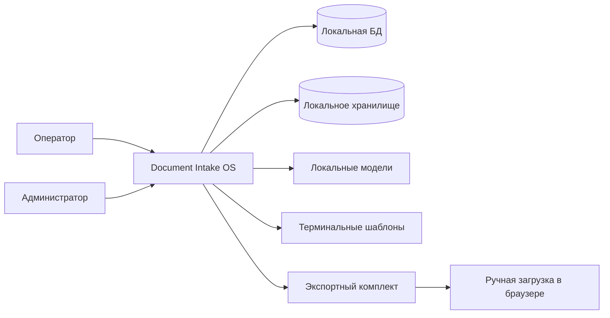
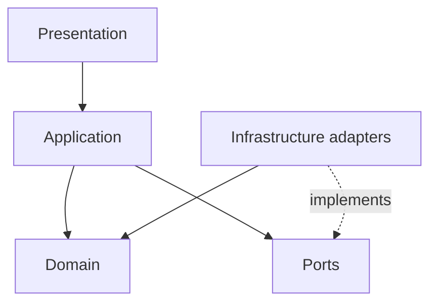
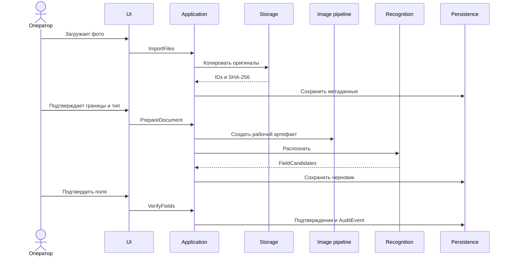

# Архитектура Document Intake OS

## 1. Принципы

1. Полностью локальная обработка после установки.
2. Неразрушающая работа с оригиналами.
3. Домен отделен от инфраструктуры.
4. OCR не изменяет подтвержденные записи.
5. Excel-шаблоны являются внешними контрактами.
6. Экспорт выполняется только из снимка заявки.
7. Сбой адаптера не повреждает БД и оригиналы.
8. MVP — простой модульный монолит для одного рабочего места; ADR-017 fixes the first MVP topology as one Windows 11 x64 workstation with one active operator session at a time.
9. Windows-зависимости изолируются в адаптерах.

## 2. Контекст



Программной связи с «Конверстой» в MVP нет.

## 2.1. MVP workstation topology

ADR-017 fixes the first MVP topology as one Windows 11 x64 workstation with one active operator session at a time. The MVP does not assume a shared multi-workstation database, network-shared application storage, concurrent application writers or cross-workstation synchronization. SQLite may be evaluated for this single-workstation topology. Filesystem ownership and locking may assume one active application session. Future local accounts are not prohibited, but authentication, passwords, inactivity timeout and recovery remain deferred to PR-031. This documentation gate does not implement SQLite, storage, users or authentication.


## 3. Слои



### Domain

Сущности, value objects, статусы, переходы, политики подтверждения, комплектность и снимки. Не импортирует PySide6, SQLite, OpenCV, OCR и Excel.

### Application

Use cases:

- создать партию;
- импортировать оригинал;
- создать области;
- подготовить документ;
- запустить OCR;
- подтвердить поля;
- связать сущности;
- создать заявку;
- проверить комплектность;
- создать snapshot;
- экспортировать;
- backup/restore.

### Persistence

Репозитории, unit of work, миграции и транзакции. Предлагается SQLite. Механизм шифрования выбирается отдельным ADR.

### Storage

Immutable originals, artifacts, snapshots, exports, checksums, atomic writes and backup.

### Image pipeline

EXIF, quality, segmentation, crop, perspective, correction, merge and JPEG compression.

### Recognition

Classification, OCR, MRZ, barcode, field extraction, confidence and source regions.

### Terminal adapters

Общий контракт, TSP, Visitors, MGS, completeness rules and golden tests.

### UI

Главная, партии, сегментация, OCR review, люди, транспорт, заявки, экспорт и администрирование.

## 4. Структура пакета

```text
src/document_intake/
├── domain/
│   ├── entities/
│   ├── value_objects/
│   ├── policies/
│   ├── enums.py
│   └── errors.py
├── application/
│   ├── commands/
│   ├── queries/
│   ├── ports/
│   └── dto/
├── persistence/
├── storage/
├── image_pipeline/
├── recognition/
├── terminal_adapters/
└── ui/
```

## 5. Основные порты

### StoragePort

- импорт оригинала;
- чтение по ID;
- хранение подготовленного артефакта;
- проверка checksum;
- atomic publish.

### RecognitionPort

Получает `RecognitionRequest`, возвращает версионный `RecognitionResult` с кандидатами, источниками, confidence и diagnostics.

### TerminalAdapter

- `validate_snapshot`;
- `export`;
- `verify_output`;
- terminal/template/rules version.

### UnitOfWork

Обеспечивает согласованность репозиториев и статусов. Файловые операции публикуются до фиксации конечного статуса.

## 6. Основной поток



## 7. Экспорт

1. загрузить текущие сущности;
2. применить терминальные правила;
3. убедиться, что critical fields подтверждены;
4. создать immutable snapshot;
5. проверить template checksum;
6. сформировать Excel во временной папке;
7. подготовить JPEG и manifest;
8. повторно открыть/проверить книгу;
9. атомарно опубликовать пакет;
10. поставить `EXPORTED`.

## 8. Транзакционность

- импорт считается успешным только после записи файла и метаданных;
- артефакт пишется во временное имя;
- `EXPORTED` ставится только после публикации;
- повторный export не меняет snapshot;
- OCR failure не меняет verified data;
- restart очищает незавершенный temp без удаления валидных файлов.

## 9. Фоновые задачи

OCR, quality analysis и export выполняются вне UI thread. Отмена не должна оставлять ложный статус. Повторный OCR создает новый run.

## 10. Платформенность

- домен не использует Windows API;
- `pathlib`;
- Excel COM только внутри TSP adapter;
- key storage за портом;
- UI и бизнес-логика не зависят от реестра Windows.

## 11. Нерешенные решения

- encryption;
- key storage;
- OCR runtime;
- migrations library;
- `.xlsx` library;
- `.xls` strategy;
- local authentication.


## PR-005 encrypted persistence candidate

Persistence now includes an encrypted SQLCipher adapter candidate for PR-005. Application ports remain independent of SQLCipher; repositories and Unit of Work are implemented by the persistence adapter. Filesystem storage remains separate. PR-005 selects an internal forward-only migration runner. DPAPI, key hierarchy and filesystem encryption remain outside PR-005. No plaintext adapter exists and final release binding/licensing approval is not claimed.

## PR-006 lifecycle note

PR-005: `COMPLETED AND HUMAN ACCEPTED`. PR-006: `AUTHORIZED AND IN REVIEW, NOT ACCEPTED`. PR-007 and later: `UNAUTHORIZED`. Gate 1: `NOT ACCEPTED`. M2: `NOT COMPLETED`. Q-009: `DEFERRED`; PR-006 implements immutable stored final artifacts and no retention, deletion or secure-deletion policy. Q-017: `DEFERRED`; PR-006 storage layout is backup-neutral and PR-032 remains responsible for encrypted backup/restore. Real documents and personal data remain prohibited in Git, Codex and CI.
