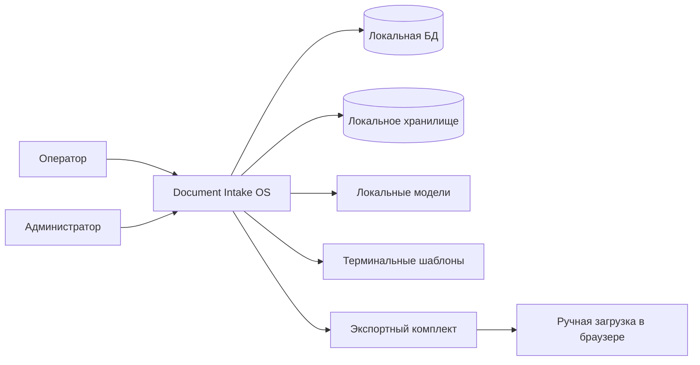
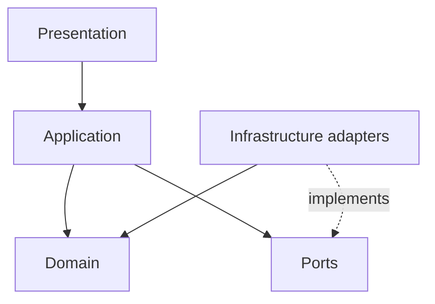
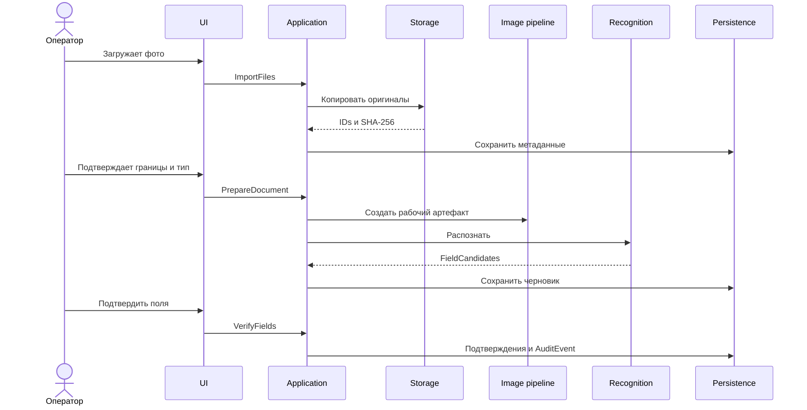

# Архитектура Document Intake OS

## 1. Принципы

1. Полностью локальная обработка после установки.
2. Неразрушающая работа с оригиналами.
3. Домен отделен от инфраструктуры.
4. OCR не изменяет подтвержденные записи.
5. Excel-шаблоны являются внешними контрактами.
6. Экспорт выполняется только из снимка заявки.
7. Сбой адаптера не повреждает БД и оригиналы.
8. MVP — простой модульный монолит для одного рабочего места; ADR-017 fixes the first MVP topology as one Windows 11 x64 workstation with one active operator session at a time.
9. Windows-зависимости изолируются в адаптерах.

## 2. Контекст


```mermaid
flowchart LR
    Operator[Оператор] --> App[Document Intake OS]
    Admin[Администратор] --> App
    App --> DB[(Локальная БД)]
    App --> FS[(Локальное хранилище)]
    App --> OCR[Локальные модели]
    App --> Excel[Терминальные шаблоны]
    App --> Export[Экспортный комплект]
    Export --> Browser[Ручная загрузка в браузере]
```

Программной связи с «Конверстой» в MVP нет.

## 2.1. MVP workstation topology

ADR-017 fixes the first MVP topology as one Windows 11 x64 workstation with one active operator session at a time. The MVP does not assume a shared multi-workstation database, network-shared application storage, concurrent application writers or cross-workstation synchronization. SQLite may be evaluated for this single-workstation topology. Filesystem ownership and locking may assume one active application session. Future local accounts are not prohibited, but authentication, passwords, inactivity timeout and recovery remain deferred to PR-031. This documentation gate does not implement SQLite, storage, users or authentication.


## 3. Слои


```mermaid
flowchart TB
    UI[Presentation]
    APP[Application]
    DOMAIN[Domain]
    PORTS[Ports]
    ADAPTERS[Infrastructure adapters]

    UI --> APP
    APP --> DOMAIN
    APP --> PORTS
    ADAPTERS -. implements .-> PORTS
    ADAPTERS --> DOMAIN
```

### Domain

Сущности, value objects, статусы, переходы, политики подтверждения, комплектность и снимки. Не импортирует PySide6, SQLite, OpenCV, OCR и Excel.

### Application

Use cases:

- создать партию;
- импортировать оригинал;
- создать области;
- подготовить документ;
- запустить OCR;
- подтвердить поля;
- связать сущности;
- создать заявку;
- проверить комплектность;
- создать snapshot;
- экспортировать;
- backup/restore.

### Persistence

Репозитории, unit of work, миграции и транзакции. Предлагается SQLite. Механизм шифрования выбирается отдельным ADR.

### Storage

Immutable originals, artifacts, snapshots, exports, checksums, atomic writes and backup.

### Image pipeline

EXIF, quality, segmentation, crop, perspective, correction, merge and JPEG compression.

### Recognition

Classification, OCR, MRZ, barcode, field extraction, confidence and source regions.

### Terminal adapters

Общий контракт, TSP, Visitors, MGS, completeness rules and golden tests.

### UI

Главная, партии, сегментация, OCR review, люди, транспорт, заявки, экспорт и администрирование.

## 4. Структура пакета

```text
src/document_intake/
├── domain/
│   ├── entities/
│   ├── value_objects/
│   ├── policies/
│   ├── enums.py
│   └── errors.py
├── application/
│   ├── commands/
│   ├── queries/
│   ├── ports/
│   └── dto/
├── persistence/
├── storage/
├── image_pipeline/
├── recognition/
├── terminal_adapters/
└── ui/
```

## 5. Основные порты

### StoragePort

- импорт оригинала;
- чтение по ID;
- хранение подготовленного артефакта;
- проверка checksum;
- atomic publish.

### RecognitionPort

Получает `RecognitionRequest`, возвращает версионный `RecognitionResult` с кандидатами, источниками, confidence и diagnostics.

### TerminalAdapter

- `validate_snapshot`;
- `export`;
- `verify_output`;
- terminal/template/rules version.

### UnitOfWork

Обеспечивает согласованность репозиториев и статусов. Файловые операции публикуются до фиксации конечного статуса.

## 6. Основной поток


```mermaid
sequenceDiagram
    actor O as Оператор
    participant UI
    participant APP as Application
    participant FS as Storage
    participant IMG as Image pipeline
    participant REC as Recognition
    participant DB as Persistence

    O->>UI: Загружает фото
    UI->>APP: ImportFiles
    APP->>FS: Копировать оригиналы
    FS-->>APP: IDs и SHA-256
    APP->>DB: Сохранить метаданные
    O->>UI: Подтверждает границы и тип
    UI->>APP: PrepareDocument
    APP->>IMG: Создать рабочий артефакт
    APP->>REC: Распознать
    REC-->>APP: FieldCandidates
    APP->>DB: Сохранить черновик
    O->>UI: Подтвердить поля
    UI->>APP: VerifyFields
    APP->>DB: Подтверждения и AuditEvent
```

## 7. Экспорт

1. загрузить текущие сущности;
2. применить терминальные правила;
3. убедиться, что critical fields подтверждены;
4. создать immutable snapshot;
5. проверить template checksum;
6. сформировать Excel во временной папке;
7. подготовить JPEG и manifest;
8. повторно открыть/проверить книгу;
9. атомарно опубликовать пакет;
10. поставить `EXPORTED`.

## 8. Транзакционность

- импорт считается успешным только после записи файла и метаданных;
- артефакт пишется во временное имя;
- `EXPORTED` ставится только после публикации;
- повторный export не меняет snapshot;
- OCR failure не меняет verified data;
- restart очищает незавершенный temp без удаления валидных файлов.

## 9. Фоновые задачи

OCR, quality analysis и export выполняются вне UI thread. Отмена не должна оставлять ложный статус. Повторный OCR создает новый run.

## 10. Платформенность

- домен не использует Windows API;
- `pathlib`;
- Excel COM только внутри TSP adapter;
- key storage за портом;
- UI и бизнес-логика не зависят от реестра Windows.

## 11. Нерешенные решения

- encryption;
- key storage;
- OCR runtime;
- migrations library;
- `.xlsx` library;
- `.xls` strategy;
- local authentication.


## PR-005 encrypted persistence candidate

Persistence now includes an encrypted SQLCipher adapter candidate for PR-005. Application ports remain independent of SQLCipher; repositories and Unit of Work are implemented by the persistence adapter. Filesystem storage remains separate. PR-005 selects an internal forward-only migration runner. DPAPI, key hierarchy and filesystem encryption remain outside PR-005. No plaintext adapter exists and final release binding/licensing approval is not claimed.

## Historical lifecycle snapshot — Historical PR-006 lifecycle note

PR-005: `COMPLETED AND HUMAN ACCEPTED`. PR-006: `COMPLETED AND HUMAN ACCEPTED`. PR-007: `COMPLETED AND HUMAN ACCEPTED`. PR-008: `COMPLETED AND HUMAN ACCEPTED WITH DOCUMENTED RESIDUAL RISK`; RISK-PR008-W11-SMOKE: `ACCEPTED FOR PR-008; DEFERRED TO INSTALLER/PILOT/RELEASE`; PR-009: `AUTHORIZED, NOT STARTED`; PR-010 AND LATER: `UNAUTHORIZED`; Gate 2: `NOT ACCEPTED`; M3: `IN PROGRESS`. Gate 1: `COMPLETED AND HUMAN ACCEPTED`. M2: `COMPLETED AND HUMAN ACCEPTED`. Q-009: `DEFERRED`; PR-006 implements immutable stored final artifacts and no retention, deletion or secure-deletion policy. Q-017: `DEFERRED`; PR-006 storage layout is backup-neutral and PR-032 remains responsible for encrypted backup/restore. Real documents and personal data remain prohibited in Git, Codex and CI.

## Historical lifecycle snapshot — Lifecycle update — PR-006 acceptance and PR-007 authorization

Verified live base SHA: `4c117ededc250d57961e2f5f4c8b4de01edf0c54`.

PR-006: `COMPLETED AND HUMAN ACCEPTED` through GitHub PR `#17`, final reviewed head `28d8b590adb7a7ae11e35f631eb9895c930b3cef`, merge commit `4c117ededc250d57961e2f5f4c8b4de01edf0c54`, merge date `2026-07-19`, final v0001 checksum `e1e1f5f6d8d675a146f3d0c538a0d544b6f8a984c301d177ee1ad86e42f2d500`, final v0002 checksum `fb953af64efd3e860960eae8ef1f4078afd0a6ec078a33594e271a9285d7db3d`, local verification `306 passed, 2 skipped on macOS`, exact-head GitHub Actions jobs passed for Python checks on Ubuntu, Python checks on Windows, PR-S001 Windows encryption spike and PR-S001 DPAPI cross-runner negative, and exact-head CI workflow run `CI #85` succeeded.

ADR numbering after repair: ADR-019 is PR-005 SQLCipher binding and raw-key staging; ADR-020 is immutable encrypted filesystem storage v1; ADR-021 is immutable PII-safe audit events. The PR #17 description historically referred to the storage decision as ADR-019 before this documentation numbering correction.

PR-007: `COMPLETED AND HUMAN ACCEPTED`. PR-007 was merged and human accepted through GitHub PR #19. PR-008: `COMPLETED AND HUMAN ACCEPTED WITH DOCUMENTED RESIDUAL RISK`; RISK-PR008-W11-SMOKE: `ACCEPTED FOR PR-008; DEFERRED TO INSTALLER/PILOT/RELEASE`; PR-009: `AUTHORIZED, NOT STARTED`; PR-010 AND LATER: `UNAUTHORIZED`; Gate 2: `NOT ACCEPTED`; M3: `IN PROGRESS`. Gate 1: `COMPLETED AND HUMAN ACCEPTED`. M2: `COMPLETED AND HUMAN ACCEPTED`. PR-009 is authorized, not started; PR-010 and later remain unauthorized.

Q-009: `DEFERRED`. Q-017: `DEFERRED`. Q-010: `ACCEPTED`. `RISK-PR005-RAWKEY-PRAGMA` remains open for installer, pilot and production release. Existing unresolved SQLCipher legal, redistribution and release-binding questions remain unresolved. Real documents and personal data remain prohibited in Git, Codex, CI, logs and test reports. The sensitive-data/private-contour gate remains open for real data.

## Historical lifecycle snapshot — Lifecycle update — PR-007 acceptance and PR-008 authorization

PR-007: `COMPLETED AND HUMAN ACCEPTED`. GitHub PR: `#19`. Final reviewed head: `c6d6852ba3cf28060d8fbb76e27201cbbcaade54`. Merge commit: `71dfd7fa31bd67c9f9fa54cc9057684486e842ad`. Merged date: `2026-07-20`. Exact-head CI: `CI #92`, successful. Migration v0003 final checksum: `e01d441c2572ca484cf5227d94f57a3cb62fa8e6e3e223eefc6852b81f6eb3c1`.

M2: `COMPLETED AND HUMAN ACCEPTED`. Gate 1: `COMPLETED AND HUMAN ACCEPTED`. PR-008: `COMPLETED AND HUMAN ACCEPTED WITH DOCUMENTED RESIDUAL RISK` for the non-UI encrypted original import and advisory duplicate-detection foundation only, governed by ADR-022, PR #21 and PR-008-D1. PR-009: `AUTHORIZED, NOT STARTED`; PR-010 AND LATER: `UNAUTHORIZED`. Do not claim Gate 2 is accepted, do not claim a physical Windows 11 smoke occurred, and do not begin PR-010 or later work.

Q-006: `DEFERRED`. Q-007: `DEFERRED`. Q-009: `DEFERRED`. Q-010: `ACCEPTED`. Q-017: `DEFERRED`. `RISK-PR005-RAWKEY-PRAGMA` remains open for installer, pilot and production release. The sensitive-data/private-contour gate remains open for real documents and real personal data. Real documents and personal data remain prohibited in Git, Codex, CI, logs and test reports.

## PR-008 implementation evidence note

PR-008 implementation records encrypted source-file import and advisory duplicate detection only. Original bytes are stored through the accepted encrypted storage port, metadata remains in SQLCipher, source paths are not persisted, decoder dependencies are pinned to `Pillow==12.3.0` and `pi-heif==1.4.0`, and no OCR, telemetry, cloud service, export, or PR-009 behavior is authorized by this change.


## Historical lifecycle snapshot — PR-009 calibration lifecycle update — 2026-07-22

ADR-023: ACCEPTED.
PR-009: IMPLEMENTED AND READY FOR HUMAN ACCEPTANCE WITH DOCUMENTED RESIDUAL LIMITATION.
Q-021: DEFERRED — NEGATIVE CALIBRATION EVIDENCE ACCEPTED; NO PRODUCTION POLICY SELECTED.
Production default PR-009 quality policy: NOT ACTIVE.
RISK-PR009-NO-PRODUCTION-QUALITY-POLICY: OPEN AND ACCEPTED FOR THE PR-009 INFRASTRUCTURE MERGE BOUNDARY.
PR-010 AND LATER: UNAUTHORIZED.
Gate 2: NOT ACCEPTED.
M3: IN PROGRESS.

The explicit-policy infrastructure may be human accepted and merged under the residual limitation. Production composition must fail closed without a separately accepted policy; no process-global, hidden or default production policy is permitted.
## Historical lifecycle snapshot — PR-009 human acceptance lifecycle state — 2026-07-22

PR-009: COMPLETED AND HUMAN ACCEPTED WITH DOCUMENTED RESIDUAL LIMITATION.
Q-021: DEFERRED — NEGATIVE CALIBRATION EVIDENCE ACCEPTED; NO PRODUCTION POLICY SELECTED.
Production default PR-009 quality policy: NOT ACTIVE.
Production policy_id: NOT ASSIGNED.
Production policy_version: NOT ASSIGNED.
Automatic PR-009 quality-based document blocking: NOT ACTIVE.
Automatic PR-009 production RETAKE_REQUIRED enforcement: NOT ACTIVE.
RISK-PR009-NO-PRODUCTION-QUALITY-POLICY: OPEN AND ACCEPTED FOR THE PR-009 INFRASTRUCTURE AND HUMAN-ACCEPTANCE BOUNDARY.
PR-010 CONTRACT DEFINITION: AUTHORIZED, NOT STARTED.
PR-010 PRODUCTION IMPLEMENTATION: UNAUTHORIZED.
PR-011 AND LATER: UNAUTHORIZED.
Gate 2: NOT ACCEPTED.
M3: IN PROGRESS.

GitHub PR: #24.
Final reviewed head: `72c01662031f73985f8715d6c3c87abf7aa5c4db`.
Merge commit: `b491226878cabfc87c484f6a4d41bc2969851273`.
Merge date: 2026-07-22.

This current PR-009-D4-backed section supersedes earlier historical lifecycle snapshots for current status only. It does not rewrite those historical records and does not authorize PR-010 production implementation or PR-011 and later work. FR-04 remains incomplete because geometry, document regions and later image-preparation work remain future scope.
## PR-010 geometry contract staging

ADR-024 proposes the deterministic image geometry recipe v1 boundary for future PR-010. The staged implementation must use existing application ports in `src/document_intake/application/ports/`, the accepted SQLCipher Unit of Work in `src/document_intake/persistence/unit_of_work.py`, immutable storage, image-pipeline adapters under `src/document_intake/image_pipeline/`, and PII-safe audit integration. It must not add production code in this documentation-only PR.


## Historical lifecycle snapshot — Current PR-010 geometry contract staging — 2026-07-23

This current section supersedes historical lifecycle sections for current status only and does not rewrite the historical record.

PR #26 merged successfully on 2026-07-23 from reviewed head `cc79a80fcacdbde2667cae858815b30176f87555` at merge commit `f27647e8cdfb2f8d3e5bb13478a4df50987ca1cb`; exact-head CI `CI #129` succeeded. PR-009 is COMPLETED AND HUMAN ACCEPTED WITH DOCUMENTED RESIDUAL LIMITATION. Q-021 is DEFERRED — NEGATIVE CALIBRATION EVIDENCE ACCEPTED; NO PRODUCTION POLICY SELECTED. Production default PR-009 quality policy is NOT ACTIVE. Production `policy_id` and `policy_version` are NOT ASSIGNED. Automatic PR-009 quality-based document blocking and production RETAKE_REQUIRED enforcement are NOT ACTIVE. `RISK-PR009-NO-PRODUCTION-QUALITY-POLICY` remains OPEN AND ACCEPTED FOR THE PR-009 INFRASTRUCTURE AND HUMAN-ACCEPTANCE BOUNDARY. ADR-024 is PROPOSED. PR-010 CONTRACT is PROPOSED FOR HUMAN REVIEW. PR-010 PRODUCTION IMPLEMENTATION is UNAUTHORIZED. PR-011 AND LATER are UNAUTHORIZED. Gate 2 is NOT ACCEPTED. M3 is IN PROGRESS.


## Historical lifecycle snapshot — Current lifecycle state — 2026-07-26

This current section supersedes earlier lifecycle snapshots for current status only and does not rewrite the historical record.

PR-005: COMPLETED AND HUMAN ACCEPTED. PR-006: COMPLETED AND HUMAN ACCEPTED. PR-007: COMPLETED AND HUMAN ACCEPTED. PR-008: COMPLETED AND HUMAN ACCEPTED WITH DOCUMENTED RESIDUAL RISK. PR-009: COMPLETED AND HUMAN ACCEPTED WITH DOCUMENTED RESIDUAL LIMITATION. PR-010: COMPLETED AND HUMAN ACCEPTED. ADR-024: ACCEPTED. PR-010 contract: ACCEPTED. PR-010 CONTRACT: ACCEPTED.

PR-010 evidence: GitHub PR #28; final reviewed head `8b6a3cf69d697807a20e763605b4601104844f04`; merge commit `99cdcaebe25551a24062e4e356ff47e868ac8f6a`; exact-head workflow `CI #138`; workflow run ID `30034157725`; conclusion `success`. Ubuntu and Windows full pytest, Ubuntu and Windows `uv build`, and Windows PR-006 through PR-010 verifiers passed. Current schema version before PR-011: `6`. Frozen v0006 checksum: `ac9d5bfbe79160d880f30af6ee1ed645ab500b9be140a18b9d6498cc68eba5ec`.

The accepted PR-010 boundary is immutable originals; EXIF orientation applied exactly once; deterministic source-effective coordinate space; manual quadrilateral geometry; perspective transformation; clockwise quarter-turn rotation; deterministic output dimensions; append-only geometry-recipe revisions; canonical persistence validation; atomic geometry-recipe and audit persistence; no final prepared JPEG publication; and no PR-011 or later behavior. PR-010 alone does not complete manual JPEG preparation because PR-011, PR-012 and PR-013 remain incomplete.

Q-021: DEFERRED — NEGATIVE CALIBRATION EVIDENCE ACCEPTED; NO PRODUCTION POLICY SELECTED. RISK-PR009-NO-PRODUCTION-QUALITY-POLICY remains OPEN AND ACCEPTED FOR THE PR-009 INFRASTRUCTURE AND HUMAN-ACCEPTANCE BOUNDARY. Production PR-009 quality policy: NOT ACTIVE. Production `policy_id`: NOT ASSIGNED. Production `policy_version`: NOT ASSIGNED. Automatic PR-009 quality blocking: NOT ACTIVE. Automatic production `RETAKE_REQUIRED`: NOT ACTIVE. ADR-025: ACCEPTED. PR-011 CONTRACT: ACCEPTED. PR-011 PRODUCTION IMPLEMENTATION: IMPLEMENTED AND IN REVIEW; NOT HUMAN ACCEPTED. PR-012 AND LATER: UNAUTHORIZED. Gate 2: NOT ACCEPTED. M3: IN PROGRESS.

PR-011 is implemented in review on the accepted exact base; PR-012 and PR-013 remain unauthorized.

Real documents and personal data remain prohibited in Git, Codex and CI.


Product owner authorization date: 2026-07-26. Accepted contract and implementation base: `f007fb5a04a5c69c70a37faf7ba12fa6775ae819`. Current schema version: `7`. Final v0007 checksum: `afad8ccc6de4ef81d73f137cbffa5a45fec1fdbb6940eabb0507cc9d6580a4a7`. V0007 uses a checksum-protected `DISABLED_DURING_TABLE_REBUILD` execution mode, a transactional populated-table copy, foreign-key checks before and after restoration, and no internal SQLite schema edits. Candidate evidence uses the production attempt generator and observer; determinism reuses the same PR-010 RGB render; verifier privacy uses an exact allowlist and runtime forbidden-value checks. ADR-025: ACCEPTED. PR-011 CONTRACT: ACCEPTED. PR-011 PRODUCTION IMPLEMENTATION: IMPLEMENTED AND IN REVIEW; NOT HUMAN ACCEPTED. PR-012 AND LATER: UNAUTHORIZED. Q-021: DEFERRED. PRODUCTION PR-009 QUALITY POLICY: NOT ACTIVE. PRODUCTION `policy_id`: NOT ASSIGNED. PRODUCTION `policy_version`: NOT ASSIGNED. AUTOMATIC PR-009 QUALITY BLOCKING: NOT ACTIVE. AUTOMATIC PRODUCTION `RETAKE_REQUIRED`: NOT ACTIVE. GATE 2: NOT ACCEPTED. M3: IN PROGRESS. Real documents and personal data remain prohibited in Git, Codex and CI.


## Current lifecycle state — 2026-07-28

This section is authoritative for current lifecycle status. It supersedes earlier dated lifecycle snapshots for current status only and does not rewrite their historical record.

```text
PR-011: COMPLETED AND HUMAN ACCEPTED
PR-011 FINAL REVIEWED HEAD:
639e1c68e2fd5f3de15c45028d4926c1fa8c10bf
PR-011 MERGE COMMIT:
72cf3852e286b711969f7277539654573818d859
PR-011 EXACT-HEAD CI:
CI #166 / run ID 30362433088 / success
SCHEMA VERSION:
7
V0007 CHECKSUM:
afad8ccc6de4ef81d73f137cbffa5a45fec1fdbb6940eabb0507cc9d6580a4a7
ADR-026:
PROPOSED
PR-012 CONTRACT:
PROPOSED FOR HUMAN REVIEW
PR-012 PRODUCTION IMPLEMENTATION:
UNAUTHORIZED
PR-013 AND LATER:
UNAUTHORIZED
GATE 2:
NOT ACCEPTED
M3:
IN PROGRESS
```

PR-011 is merged and human accepted under [PR-011-D3](decisions/PR-011-D3-lifecycle-acceptance.md). [ADR-026](decisions/ADR-026-document-regions-v1.md) and the [PR-012 contract](tasks/PR-012-multiple-documents-per-image.md) are proposals for Product-owner review only. Contract preparation is authorized; production implementation is not.

Q-021: DEFERRED. PRODUCTION PR-009 QUALITY POLICY: NOT ACTIVE. PRODUCTION `policy_id`: NOT ASSIGNED. PRODUCTION `policy_version`: NOT ASSIGNED. AUTOMATIC PR-009 QUALITY BLOCKING: NOT ACTIVE. AUTOMATIC PRODUCTION `RETAKE_REQUIRED`: NOT ACTIVE. Real documents and personal data remain prohibited in Git, Codex, and CI.
