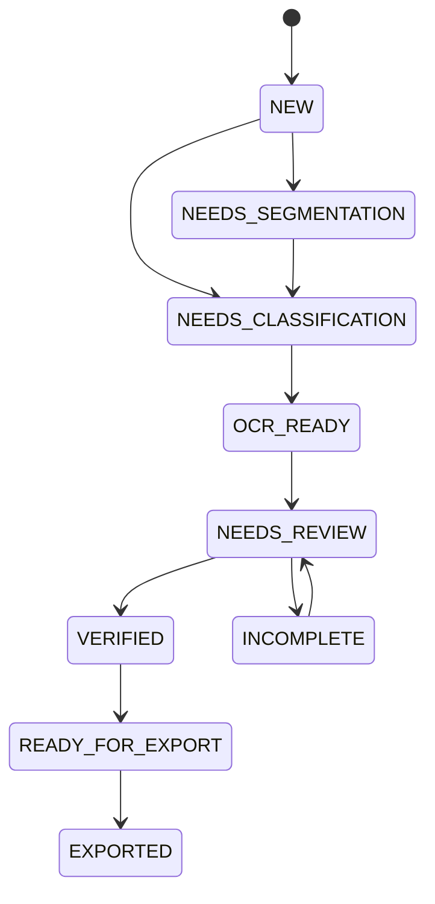

# Доменная модель

## 1. Инварианты верхнего уровня

- одно фото может содержать несколько документов;
- один документ может состоять из нескольких фото;
- оригинал, подготовленный артефакт и подтвержденная запись — разные объекты;
- распознанное значение не равно подтвержденному;
- водитель и транспорт связываются в заявке;
- экспорт читает snapshot;
- critical fields имеют явный статус.

## 2. UploadBatch

Поля: `id`, `number`, `created_at`, `created_by`, `status`, `source_file_ids`, `notes`.

Статусы: `NEW`, `PROCESSING`, `NEEDS_REVIEW`, `READY`, `ARCHIVED`.

## 3. SourceFile

Поля:

- `id`, `batch_id`;
- `original_name`, `stored_path`, `media_type`;
- `byte_size`, `sha256`, `perceptual_hash`;
- `width`, `height`, `exif_orientation`;
- `imported_at`, `imported_by`;
- `quality_assessment`.

Инвариант: байты после импорта не меняются.

## 4. DocumentRegion

Поля: `id`, `source_file_id`, `polygon`, `rotation`, `order_index`, `confirmed_by_operator`, `version`.

Координаты относятся к оригиналу. Изменение области создает новую версию подготовки.

## 5. Document

Поля:

- `id`;
- `document_type`;
- `country_code`;
- `template_version`;
- `owner_kind`, `owner_id`;
- `side_ids`;
- `prepared_artifact_id`;
- `classification_status`;
- `recognition_status`;
- `verification_status`;
- `validity_status`.

Типы:

- `PASSPORT`;
- `IDENTITY_CARD`;
- `DRIVER_LICENSE`;
- `MIGRATION_CARD`;
- `WORK_PERMIT`;
- `TEMPORARY_REGISTRATION`;
- `VEHICLE_REGISTRATION_TRACTOR`;
- `VEHICLE_REGISTRATION_TRAILER`;
- `PASSPORT_STAMP_PAGE`;
- `OTHER`.

## 6. RecognitionRun

Одна версия распознавания: engine/model/extractor versions, timestamps, status, diagnostics and candidate IDs. Новый запуск не перезаписывает предыдущий.

## 7. FieldCandidate

Поля:

- `field_key`;
- `raw_value`;
- `normalized_value`;
- `source_type`;
- `confidence`;
- `source_region`;
- `validation_results`;
- `conflict_group`;
- `recognition_run_id`.

Источники:

- `VISUAL_OCR`;
- `MRZ`;
- `BARCODE`;
- `TEMPLATE_RULE`;
- `RELATED_DOCUMENT`;
- `OPERATOR_ENTRY`.

## 8. VerifiedField

Поля: entity, field, value, status, actor, timestamp, source candidate, override reason.

Статусы:

- `UNVERIFIED`;
- `VERIFIED`;
- `CONFLICT`;
- `NOT_APPLICABLE`;
- `ADMIN_OVERRIDE`.

Critical field не становится verified без пользователя. Override требует причины.

## 9. Person

- ФИО кириллицей;
- ФИО латиницей;
- birth date/place;
- sex;
- citizenship;
- phone;
- registration address.

Отчество не достраивается. MRZ не дает кириллическое ФИО.

## 10. IdentityDocument

- type;
- series;
- number;
- full number;
- issue/expiry date;
- issuer;
- division code;
- personal number;
- MRZ raw и validation status.

Все номера — строки. Ведущие нули сохраняются.

## 11. MigrationDocument

- series/number;
- arrival/end dates;
- declared identity number;
- declared citizenship;
- stamp data;
- related passport.

Рукописные поля подтверждаются вручную. Расхождение с паспортом — conflict.

## 12. Vehicle

- role;
- registration number;
- VIN/chassis/body;
- make/model/year;
- color/type;
- max/unladen mass;
- owner;
- registration document.

Роли: `TRACTOR`, `TRAILER`, `SEMI_TRAILER`, `OTHER`.

For PR-005, `Vehicle.registration_document_id` is an opaque optional `EntityId`. It is not a foreign key to `Document` and does not imply document ownership or insertion ordering. Normalizing this reference is deferred until a document ownership contract is separately designed and accepted.

## 13. Terminal

- `code`;
- `display_name`;
- `adapter_version`;
- `template_version`;
- `template_checksum`;
- `rules_version`;
- `is_active`.

Коды: `TSP`, `VISITORS`, `MGS`.

## 14. Application

Изменяемая заявка:

- terminal;
- batch;
- participant assignments;
- validation report;
- status;
- author/timestamps.

Статусы: `DRAFT`, `INCOMPLETE`, `READY_FOR_SNAPSHOT`, `SNAPSHOTTED`, `EXPORTED`, `FAILED`.

## 15. ParticipantAssignment

Связь `person + tractor + trailer + pass type + position + organization` внутри конкретной заявки.

## 16. ApplicationSnapshot

- application ID;
- terminal;
- template/rules versions;
- created by/at;
- immutable payload;
- document artifact refs;
- snapshot hash.

Изменение карточки после snapshot не меняет старую заявку.

## 17. ExportRun

- snapshot ID;
- timestamps;
- status;
- output path;
- Excel/manifest checksums;
- warnings;
- error code.

## 18. AuditEvent

- actor;
- action;
- entity ID;
- field key;
- masked old/new values;
- reason;
- timestamp;
- correlation ID.

Журнал не хранит полное PII.

## 19. Переход документа

## 20. Дедупликация

- SHA-256 — точный дубль;
- perceptual hash — похожее изображение;
- ФИО + дата + номер — предложение человека;
- VIN/госномер — предложение транспорта.

Автоматическое слияние запрещено.

## 21. PR-004 implementation status

Implemented in PR-004: domain enums, reusable immutable value objects, core entities, the documented document workflow state machine, human-verification policy, critical-field resolution rules, immutable application snapshots, deterministic snapshot hashing, snapshot creation invariants, and PII-safe representations/errors.

Deferred exactly as domain-model concepts for later PRs: UploadBatch behavior, SourceFile metadata/import behavior, DocumentRegion geometry/version behavior, RecognitionRun lifecycle, ExportRun, AuditEvent, automatic deduplication, completeness matrices, terminal-specific participant limits, terminal-specific required-document rules, country-specific document validation, OCR/MRZ parsing, persistence repositories and filesystem references beyond opaque `EntityId` values.

## PR-005 persisted PR-004 domain scope

PR-005 persists only existing PR-004 domain concepts: Person, IdentityDocument, MigrationDocument, Vehicle, Terminal, Document, FieldCandidate, Application with ParticipantAssignment, VerifiedField and ValidationReport issues, and immutable ApplicationSnapshot artifact references. UploadBatch, SourceFile, DocumentRegion, RecognitionRun, ExportRun, AuditEvent and filesystem references beyond opaque IDs remain deferred. Intentionally opaque references include `Application.batch_id`, document side IDs, prepared artifact IDs, snapshot artifact references and `Vehicle.registration_document_id`. The PR-005 persistence slice for FR-13 is COMPLETED AND HUMAN ACCEPTED. FR-13 remains not fully complete beyond the accepted persisted PR-004 domain scope because later storage and application concepts remain deferred.
