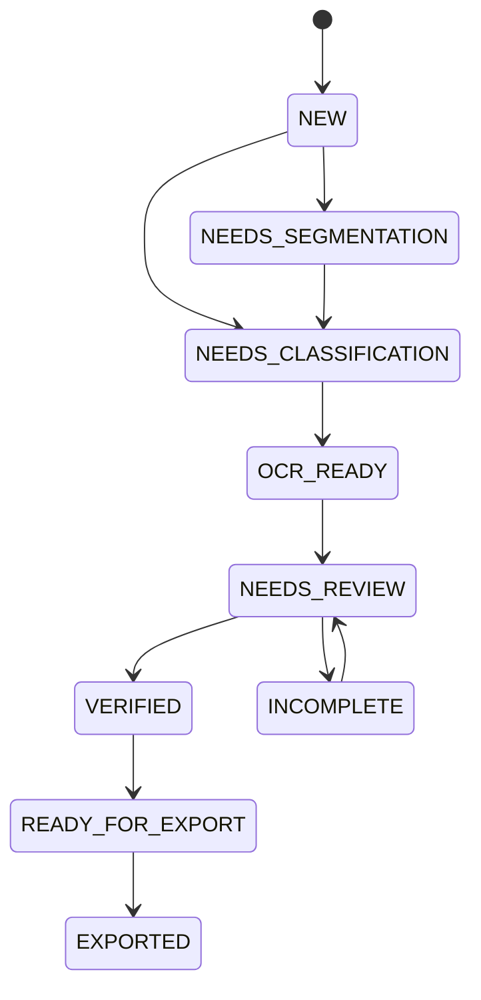

# Доменная модель

## 1. Инварианты верхнего уровня

- одно фото может содержать несколько документов;
- один документ может состоять из нескольких фото;
- оригинал, подготовленный артефакт и подтвержденная запись — разные объекты;
- распознанное значение не равно подтвержденному;
- водитель и транспорт связываются в заявке;
- экспорт читает snapshot;
- critical fields имеют явный статус.

## 2. UploadBatch

Поля: `id`, `number`, `created_at`, `created_by`, `status`, `source_file_ids`, `notes`.

Статусы: `NEW`, `PROCESSING`, `NEEDS_REVIEW`, `READY`, `ARCHIVED`.

## 3. SourceFile

Поля:

- `id`, `batch_id`;
- `original_name`, `stored_path`, `media_type`;
- `byte_size`, `sha256`, `perceptual_hash`;
- `width`, `height`, `exif_orientation`;
- `imported_at`, `imported_by`;
- `quality_assessment`.

Инвариант: байты после импорта не меняются.

## 4. DocumentRegion

Поля: `id`, `source_file_id`, `polygon`, `rotation`, `order_index`, `confirmed_by_operator`, `version`.

Координаты относятся к оригиналу. Изменение области создает новую версию подготовки.

## 5. Document

Поля:

- `id`;
- `document_type`;
- `country_code`;
- `template_version`;
- `owner_kind`, `owner_id`;
- `side_ids`;
- `prepared_artifact_id`;
- `classification_status`;
- `recognition_status`;
- `verification_status`;
- `validity_status`.

Типы:

- `PASSPORT`;
- `IDENTITY_CARD`;
- `DRIVER_LICENSE`;
- `MIGRATION_CARD`;
- `WORK_PERMIT`;
- `TEMPORARY_REGISTRATION`;
- `VEHICLE_REGISTRATION_TRACTOR`;
- `VEHICLE_REGISTRATION_TRAILER`;
- `PASSPORT_STAMP_PAGE`;
- `OTHER`.

## 6. RecognitionRun

Одна версия распознавания: engine/model/extractor versions, timestamps, status, diagnostics and candidate IDs. Новый запуск не перезаписывает предыдущий.

## 7. FieldCandidate

Поля:

- `field_key`;
- `raw_value`;
- `normalized_value`;
- `source_type`;
- `confidence`;
- `source_region`;
- `validation_results`;
- `conflict_group`;
- `recognition_run_id`.

Источники:

- `VISUAL_OCR`;
- `MRZ`;
- `BARCODE`;
- `TEMPLATE_RULE`;
- `RELATED_DOCUMENT`;
- `OPERATOR_ENTRY`.

## 8. VerifiedField

Поля: entity, field, value, status, actor, timestamp, source candidate, override reason.

Статусы:

- `UNVERIFIED`;
- `VERIFIED`;
- `CONFLICT`;
- `NOT_APPLICABLE`;
- `ADMIN_OVERRIDE`.

Critical field не становится verified без пользователя. Override требует причины.

## 9. Person

- ФИО кириллицей;
- ФИО латиницей;
- birth date/place;
- sex;
- citizenship;
- phone;
- registration address.

Отчество не достраивается. MRZ не дает кириллическое ФИО.

## 10. IdentityDocument

- type;
- series;
- number;
- full number;
- issue/expiry date;
- issuer;
- division code;
- personal number;
- MRZ raw и validation status.

Все номера — строки. Ведущие нули сохраняются.

## 11. MigrationDocument

- series/number;
- arrival/end dates;
- declared identity number;
- declared citizenship;
- stamp data;
- related passport.

Рукописные поля подтверждаются вручную. Расхождение с паспортом — conflict.

## 12. Vehicle

- role;
- registration number;
- VIN/chassis/body;
- make/model/year;
- color/type;
- max/unladen mass;
- owner;
- registration document.

Роли: `TRACTOR`, `TRAILER`, `SEMI_TRAILER`, `OTHER`.

For PR-005, `Vehicle.registration_document_id` is an opaque optional `EntityId`. It is not a foreign key to `Document` and does not imply document ownership or insertion ordering. Normalizing this reference is deferred until a document ownership contract is separately designed and accepted.

## 13. Terminal

- `code`;
- `display_name`;
- `adapter_version`;
- `template_version`;
- `template_checksum`;
- `rules_version`;
- `is_active`.

Коды: `TSP`, `VISITORS`, `MGS`.

## 14. Application

Изменяемая заявка:

- terminal;
- batch;
- participant assignments;
- validation report;
- status;
- author/timestamps.

Статусы: `DRAFT`, `INCOMPLETE`, `READY_FOR_SNAPSHOT`, `SNAPSHOTTED`, `EXPORTED`, `FAILED`.

## 15. ParticipantAssignment

Связь `person + tractor + trailer + pass type + position + organization` внутри конкретной заявки.

## 16. ApplicationSnapshot

- application ID;
- terminal;
- template/rules versions;
- created by/at;
- immutable payload;
- document artifact refs;
- snapshot hash.

Изменение карточки после snapshot не меняет старую заявку.

## 17. ExportRun

- snapshot ID;
- timestamps;
- status;
- output path;
- Excel/manifest checksums;
- warnings;
- error code.

## 18. AuditEvent

- actor;
- action;
- entity ID;
- field key;
- masked old/new values;
- reason;
- timestamp;
- correlation ID.

Журнал не хранит полное PII.

## 19. Переход документа

## 20. Дедупликация

- SHA-256 — точный дубль;
- perceptual hash — похожее изображение;
- ФИО + дата + номер — предложение человека;
- VIN/госномер — предложение транспорта.

Автоматическое слияние запрещено.

## 21. PR-004 implementation status

Implemented in PR-004: domain enums, reusable immutable value objects, core entities, the documented document workflow state machine, human-verification policy, critical-field resolution rules, immutable application snapshots, deterministic snapshot hashing, snapshot creation invariants, and PII-safe representations/errors.

Deferred exactly as domain-model concepts for later PRs: UploadBatch behavior, SourceFile metadata/import behavior, DocumentRegion geometry/version behavior, RecognitionRun lifecycle, ExportRun, AuditEvent, automatic deduplication, completeness matrices, terminal-specific participant limits, terminal-specific required-document rules, country-specific document validation, OCR/MRZ parsing, persistence repositories and filesystem references beyond opaque `EntityId` values.

## PR-005 persisted PR-004 domain scope

PR-005 persists only existing PR-004 domain concepts: Person, IdentityDocument, MigrationDocument, Vehicle, Terminal, Document, FieldCandidate, Application with ParticipantAssignment, VerifiedField and ValidationReport issues, and immutable ApplicationSnapshot artifact references. UploadBatch, SourceFile, DocumentRegion, RecognitionRun, ExportRun, AuditEvent and filesystem references beyond opaque IDs remain deferred. Intentionally opaque references include `Application.batch_id`, document side IDs, prepared artifact IDs, snapshot artifact references and `Vehicle.registration_document_id`. The PR-005 persistence slice for FR-13 is COMPLETED AND HUMAN ACCEPTED. FR-13 remains not fully complete beyond the accepted persisted PR-004 domain scope because later storage and application concepts remain deferred.

## PR-006 lifecycle note

PR-005: `COMPLETED AND HUMAN ACCEPTED`. PR-006: `COMPLETED AND HUMAN ACCEPTED`. PR-007: `COMPLETED AND HUMAN ACCEPTED`. PR-008: `COMPLETED AND HUMAN ACCEPTED WITH DOCUMENTED RESIDUAL RISK`; RISK-PR008-W11-SMOKE: `ACCEPTED FOR PR-008; DEFERRED TO INSTALLER/PILOT/RELEASE`; PR-009: `AUTHORIZED, NOT STARTED`; PR-010 AND LATER: `UNAUTHORIZED`; Gate 2: `NOT ACCEPTED`; M3: `IN PROGRESS`. Gate 1: `COMPLETED AND HUMAN ACCEPTED`. M2: `COMPLETED AND HUMAN ACCEPTED`. Q-009: `DEFERRED`; PR-006 implements immutable stored final artifacts and no retention, deletion or secure-deletion policy. Q-017: `DEFERRED`; PR-006 storage layout is backup-neutral and PR-032 remains responsible for encrypted backup/restore. Real documents and personal data remain prohibited in Git, Codex and CI.

## Lifecycle update — PR-006 acceptance and PR-007 authorization

Verified live base SHA: `4c117ededc250d57961e2f5f4c8b4de01edf0c54`.

PR-006: `COMPLETED AND HUMAN ACCEPTED` through GitHub PR `#17`, final reviewed head `28d8b590adb7a7ae11e35f631eb9895c930b3cef`, merge commit `4c117ededc250d57961e2f5f4c8b4de01edf0c54`, merge date `2026-07-19`, final v0001 checksum `e1e1f5f6d8d675a146f3d0c538a0d544b6f8a984c301d177ee1ad86e42f2d500`, final v0002 checksum `fb953af64efd3e860960eae8ef1f4078afd0a6ec078a33594e271a9285d7db3d`, local verification `306 passed, 2 skipped on macOS`, exact-head GitHub Actions jobs passed for Python checks on Ubuntu, Python checks on Windows, PR-S001 Windows encryption spike and PR-S001 DPAPI cross-runner negative, and exact-head CI workflow run `CI #85` succeeded.

ADR numbering after repair: ADR-019 is PR-005 SQLCipher binding and raw-key staging; ADR-020 is immutable encrypted filesystem storage v1; ADR-021 is immutable PII-safe audit events. The PR #17 description historically referred to the storage decision as ADR-019 before this documentation numbering correction.

PR-007: `COMPLETED AND HUMAN ACCEPTED`. PR-007 was merged and human accepted through GitHub PR #19. PR-008: `COMPLETED AND HUMAN ACCEPTED WITH DOCUMENTED RESIDUAL RISK`; RISK-PR008-W11-SMOKE: `ACCEPTED FOR PR-008; DEFERRED TO INSTALLER/PILOT/RELEASE`; PR-009: `AUTHORIZED, NOT STARTED`; PR-010 AND LATER: `UNAUTHORIZED`; Gate 2: `NOT ACCEPTED`; M3: `IN PROGRESS`. Gate 1: `COMPLETED AND HUMAN ACCEPTED`. M2: `COMPLETED AND HUMAN ACCEPTED`. PR-009 is authorized, not started; PR-010 and later remain unauthorized.

Q-009: `DEFERRED`. Q-017: `DEFERRED`. Q-010: `ACCEPTED`. `RISK-PR005-RAWKEY-PRAGMA` remains open for installer, pilot and production release. Existing unresolved SQLCipher legal, redistribution and release-binding questions remain unresolved. Real documents and personal data remain prohibited in Git, Codex, CI, logs and test reports. The sensitive-data/private-contour gate remains open for real data.

## Lifecycle update — PR-007 acceptance and PR-008 authorization

PR-007: `COMPLETED AND HUMAN ACCEPTED`. GitHub PR: `#19`. Final reviewed head: `c6d6852ba3cf28060d8fbb76e27201cbbcaade54`. Merge commit: `71dfd7fa31bd67c9f9fa54cc9057684486e842ad`. Merged date: `2026-07-20`. Exact-head CI: `CI #92`, successful. Migration v0003 final checksum: `e01d441c2572ca484cf5227d94f57a3cb62fa8e6e3e223eefc6852b81f6eb3c1`.

M2: `COMPLETED AND HUMAN ACCEPTED`. Gate 1: `COMPLETED AND HUMAN ACCEPTED`. PR-008: `COMPLETED AND HUMAN ACCEPTED WITH DOCUMENTED RESIDUAL RISK` for the non-UI encrypted original import and advisory duplicate-detection foundation only, governed by ADR-022, PR #21 and PR-008-D1. PR-009: `AUTHORIZED, NOT STARTED`; PR-010 AND LATER: `UNAUTHORIZED`. Do not claim Gate 2 is accepted, do not claim a physical Windows 11 smoke occurred, and do not begin PR-010 or later work.

Q-006: `DEFERRED`. Q-007: `DEFERRED`. Q-009: `DEFERRED`. Q-010: `ACCEPTED`. Q-017: `DEFERRED`. `RISK-PR005-RAWKEY-PRAGMA` remains open for installer, pilot and production release. The sensitive-data/private-contour gate remains open for real documents and real personal data. Real documents and personal data remain prohibited in Git, Codex, CI, logs and test reports.

## PR-009 proposed image-quality domain contract

ADR-023 proposes immutable frozen/slotted `QualityAssessmentStatus`, `QualityIssueCode`, `QualityIssueSeverity`, `QualityMetricCode`, `QualityPolicyVersion`, `ImageQualityMetric`, `ImageQualityIssue`, `ImageQualityAssessment` and `ImageQualityPolicy` types. Status values are `GOOD`, `REVIEW_REQUIRED`, `RETAKE_REQUIRED`. PR-009 issue codes are `LOW_RESOLUTION`, `BLUR_DETECTED`, `LOW_CONTRAST`, `GLARE_DETECTED`, `UNDEREXPOSED`, `OVEREXPOSED`; deferred codes are `CUT_EDGES`, `PERSPECTIVE`, `DOCUMENT_NOT_FOUND`, `MULTIPLE_DOCUMENTS`. PR-009 production implementation is not started. Q-021 is open, so final production thresholds are not accepted.

## PR-009 implementation lifecycle update — 2026-07-21

ADR-023: ACCEPTED.
PR-009: IMPLEMENTED AND IN REVIEW; NOT HUMAN ACCEPTED.
Q-021: OPEN — REQUIRES PRODUCT-OWNER ACCEPTANCE.
Production default quality policy: NOT ACTIVE.
Final PR-009 human acceptance: BLOCKED UNTIL Q-021 IS ACCEPTED.
PR-010 AND LATER: UNAUTHORIZED.
Gate 2: NOT ACCEPTED.
M3: IN PROGRESS.

PR-009 implements deterministic whole-frame metrics, explicit caller-provided typed policy handling, full-resolution orientation-normalized decoding, append-only persistence, audit integration, controlled service errors, synthetic tests and a cross-platform verifier. It does not select or activate production thresholds, add UI integration, reject documents automatically, implement PR-010 geometry, PR-011 JPEG preparation, PR-012 document detection/segmentation or use real-document calibration. Migration v0005 checksum: `930d834c6c48ca2c16a1287faae18e0568da75ab6d47b72b7d5f46c52ce51885`.
