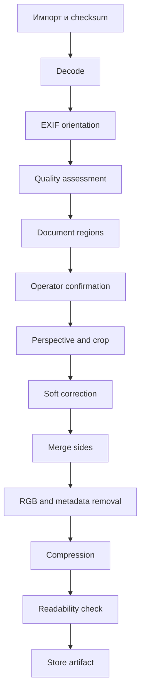

# Конвейер обработки изображений

## 1. Вход MVP

- JPG/JPEG;
- PNG;
- HEIC/HEIF.

## 2. Выходной контракт

- JPEG;
- RGB;
- стандартный цветовой профиль;
- без alpha;
- без EXIF/geolocation;
- ≤ 1,90 МиБ;
- читаемый;
- воспроизводимый;
- SHA-256;
- оригинал не изменен.

## 3. Процесс

## 4. Quality assessment

Оценивать blur, contrast, glare, exposure, resolution, cut edges, perspective and possible document count.

Статусы: `GOOD`, `REVIEW_REQUIRED`, `RETAKE_REQUIRED`.

Пороги подтверждаются пилотом.

## 5. Segmentation

Поддерживаются один/несколько документов, ручные рамки, изменение углов, разделение, объединение областей и подтверждение оператора.

## 6. Допустимые преобразования

- rotate;
- perspective correction;
- crop;
- scale;
- minimal safe margins;
- equalize side dimensions;
- moderate contrast/sharpness/noise correction.

Запрещено дорисовывать символы, удалять печати, генеративно восстанавливать отсутствующие части и менять содержание.

## 7. Склейка

Порядок: front, back. Направление vertical/horizontal — настройка до подтверждения терминального правила. Оригинальные стороны и отдельные artifacts сохраняются.

## 8. Несколько документов

Каждая подтвержденная область создает отдельный logical document. Тягач и прицеп из одного фото не объединяются в один файл.

## 9. Сжатие

1. высокое качество;
2. подбор JPEG quality;
3. при необходимости уменьшение resolution;
4. каждая попытка из несжатого рабочего изображения;
5. size/readability check.

Если лимит достижим только при потере читаемости, export блокируется.

## 10. Детерминизм

Одинаковые source checksum, regions, parameters, pipeline version and side order дают одинаковый или структурно эквивалентный результат.

## 11. PreparedArtifact

Хранит document ID, source IDs, regions, recipe, pipeline version, dimensions, size, SHA-256, quality status and timestamp.

## 12. Ошибки

`UNSUPPORTED_FORMAT`, `DECODE_FAILED`, `CHECKSUM_MISMATCH`, `DOCUMENT_NOT_FOUND`, `SEGMENTATION_REQUIRED`, `CROP_INVALID`, `COMPOSITION_INCOMPLETE`, `SIZE_LIMIT_UNREACHABLE`, `READABILITY_FAILED`, `WRITE_FAILED`.

## 13. Тесты

- byte-identical original;
- EXIF one-time;
- PNG alpha → RGB;
- EXIF removed;
- size boundary;
- front/back order;
- two regions → two documents;
- failed write keeps prior valid artifact;
- deterministic rerun.
