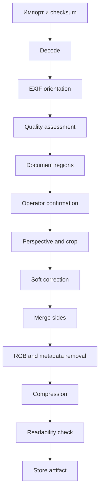

# Конвейер обработки изображений

## 1. Вход MVP

- JPG/JPEG;
- PNG;
- HEIC/HEIF.

## 2. Выходной контракт

- JPEG;
- RGB;
- стандартный цветовой профиль;
- без alpha;
- без EXIF/geolocation;
- ≤ 1,90 МиБ;
- читаемый;
- воспроизводимый;
- SHA-256;
- оригинал не изменен.

## 3. Процесс

## 4. Quality assessment

Оценивать blur, contrast, glare, exposure, resolution, cut edges, perspective and possible document count.

Статусы: `GOOD`, `REVIEW_REQUIRED`, `RETAKE_REQUIRED`.

Пороги подтверждаются пилотом.

## 5. Segmentation

Поддерживаются один/несколько документов, ручные рамки, изменение углов, разделение, объединение областей и подтверждение оператора.

## 6. Допустимые преобразования

- rotate;
- perspective correction;
- crop;
- scale;
- minimal safe margins;
- equalize side dimensions;
- moderate contrast/sharpness/noise correction.

Запрещено дорисовывать символы, удалять печати, генеративно восстанавливать отсутствующие части и менять содержание.

## 7. Склейка

Порядок: front, back. Направление vertical/horizontal — настройка до подтверждения терминального правила. Оригинальные стороны и отдельные artifacts сохраняются.

## 8. Несколько документов

Каждая подтвержденная область создает отдельный logical document. Тягач и прицеп из одного фото не объединяются в один файл.

## 9. Сжатие

1. высокое качество;
2. подбор JPEG quality;
3. при необходимости уменьшение resolution;
4. каждая попытка из несжатого рабочего изображения;
5. size/readability check.

Если лимит достижим только при потере читаемости, export блокируется.

## 10. Детерминизм

Одинаковые source checksum, regions, parameters, pipeline version and side order дают одинаковый или структурно эквивалентный результат.

## 11. PreparedArtifact

Хранит document ID, source IDs, regions, recipe, pipeline version, dimensions, size, SHA-256, quality status and timestamp.

## 12. Ошибки

`UNSUPPORTED_FORMAT`, `DECODE_FAILED`, `CHECKSUM_MISMATCH`, `DOCUMENT_NOT_FOUND`, `SEGMENTATION_REQUIRED`, `CROP_INVALID`, `COMPOSITION_INCOMPLETE`, `SIZE_LIMIT_UNREACHABLE`, `READABILITY_FAILED`, `WRITE_FAILED`.

## 13. Тесты

- byte-identical original;
- EXIF one-time;
- PNG alpha → RGB;
- EXIF removed;
- size boundary;
- front/back order;
- two regions → two documents;
- failed write keeps prior valid artifact;
- deterministic rerun.

## 14. Historical PR-009 whole-frame staging contract

At contract staging, ADR-023 proposed that PR-009 cover only deterministic whole-frame diagnostics computed from the decoded source image without segmentation or geometry inference: original EXIF orientation value, orientation-normalized analysis view, original encoded dimensions, orientation-normalized effective dimensions, minimum-resolution diagnostic, blur/sharpness metric, contrast metric, glare/highlight-clipping metric and exposure diagnostic. The broader quality list above remained the product direction for FR-04, but PR-009 did not complete all of FR-04. Cut-edge detection, perspective/skew assessment from document boundaries, document presence detection, document count, segmentation, automatic crop, perspective correction and geometric transformation were deferred to PR-010/PR-012. Q-021 remained open for final thresholds at that historical stage.

## PR-009 calibration lifecycle update — 2026-07-22

ADR-023: ACCEPTED.
PR-009: IMPLEMENTED AND READY FOR HUMAN ACCEPTANCE WITH DOCUMENTED RESIDUAL LIMITATION.
Q-021: DEFERRED — NEGATIVE CALIBRATION EVIDENCE ACCEPTED; NO PRODUCTION POLICY SELECTED.
Production default PR-009 quality policy: NOT ACTIVE.
RISK-PR009-NO-PRODUCTION-QUALITY-POLICY: OPEN AND ACCEPTED FOR THE PR-009 INFRASTRUCTURE MERGE BOUNDARY.
PR-010 AND LATER: UNAUTHORIZED.
Gate 2: NOT ACCEPTED.
M3: IN PROGRESS.

PR-009 implements deterministic whole-frame metrics, explicit caller-provided typed policy handling, full-resolution orientation-normalized decoding, append-only persistence, audit integration, controlled service errors, synthetic tests and a cross-platform verifier. The residual limitation blocks production activation of PR-009 quality decisions, not human acceptance or merge of the explicit-policy infrastructure. Human acceptance and merge are still pending; PR-010 and later require a separate post-merge product-owner decision.
## PR-009 human acceptance lifecycle state — 2026-07-22

PR-009: COMPLETED AND HUMAN ACCEPTED WITH DOCUMENTED RESIDUAL LIMITATION.
Q-021: DEFERRED — NEGATIVE CALIBRATION EVIDENCE ACCEPTED; NO PRODUCTION POLICY SELECTED.
Production default PR-009 quality policy: NOT ACTIVE.
Production policy_id: NOT ASSIGNED.
Production policy_version: NOT ASSIGNED.
Automatic PR-009 quality-based document blocking: NOT ACTIVE.
Automatic PR-009 production RETAKE_REQUIRED enforcement: NOT ACTIVE.
RISK-PR009-NO-PRODUCTION-QUALITY-POLICY: OPEN AND ACCEPTED FOR THE PR-009 INFRASTRUCTURE AND HUMAN-ACCEPTANCE BOUNDARY.
PR-010 CONTRACT DEFINITION: AUTHORIZED, NOT STARTED.
PR-010 PRODUCTION IMPLEMENTATION: UNAUTHORIZED.
PR-011 AND LATER: UNAUTHORIZED.
Gate 2: NOT ACCEPTED.
M3: IN PROGRESS.

GitHub PR: #24.
Final reviewed head: `72c01662031f73985f8715d6c3c87abf7aa5c4db`.
Merge commit: `b491226878cabfc87c484f6a4d41bc2969851273`.
Merge date: 2026-07-22.

This current PR-009-D4-backed section supersedes earlier historical lifecycle snapshots for current status only. It does not rewrite those historical records and does not authorize PR-010 production implementation or PR-011 and later work. FR-04 remains incomplete because geometry, document regions and later image-preparation work remain future scope.

## PR-010 geometry contract staging

ADR-024 proposes deterministic geometry rendering after PR-009: EXIF orientation is applied exactly once, source-effective coordinates are validated, a quadrilateral is perspective-cropped to RGB, coarse clockwise quarter-turn rotation is applied, and no production JPEG is published. PR-011 remains responsible for compression and the 1.90 MiB prepared-JPEG boundary.
