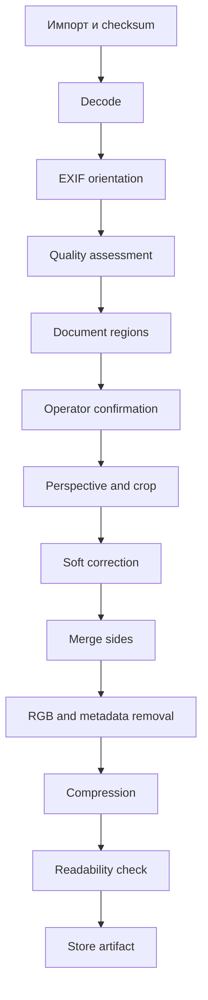

# Конвейер обработки изображений

## 1. Вход MVP

- JPG/JPEG;
- PNG;
- HEIC/HEIF.

## 2. Выходной контракт

- JPEG;
- RGB;
- стандартный цветовой профиль;
- без alpha;
- без EXIF/geolocation;
- ≤ 1,90 МиБ;
- читаемый;
- воспроизводимый;
- SHA-256;
- оригинал не изменен.

## 3. Процесс

```mermaid
flowchart TD
    A[Импорт и checksum] --> B[Decode]
    B --> C[EXIF orientation]
    C --> D[Quality assessment]
    D --> E[Document regions]
    E --> F[Operator confirmation]
    F --> G[Perspective and crop]
    G --> H[Soft correction]
    H --> I[Merge sides]
    I --> J[RGB and metadata removal]
    J --> K[Compression]
    K --> L[Readability check]
    L --> M[Store artifact]
```

## 4. Quality assessment

Оценивать blur, contrast, glare, exposure, resolution, cut edges, perspective and possible document count.

Статусы: `GOOD`, `REVIEW_REQUIRED`, `RETAKE_REQUIRED`.

Пороги подтверждаются пилотом.

## 5. Segmentation

Поддерживаются один/несколько документов, ручные рамки, изменение углов, разделение, объединение областей и подтверждение оператора.

## 6. Допустимые преобразования

- rotate;
- perspective correction;
- crop;
- scale;
- minimal safe margins;
- equalize side dimensions;
- moderate contrast/sharpness/noise correction.

Запрещено дорисовывать символы, удалять печати, генеративно восстанавливать отсутствующие части и менять содержание.

## 7. Склейка

Порядок: front, back. Направление vertical/horizontal — настройка до подтверждения терминального правила. Оригинальные стороны и отдельные artifacts сохраняются.

## 8. Несколько документов

Каждая подтвержденная область создает отдельный logical document. Тягач и прицеп из одного фото не объединяются в один файл.

## 9. Сжатие

1. высокое качество;
2. подбор JPEG quality;
3. при необходимости уменьшение resolution;
4. каждая попытка из несжатого рабочего изображения;
5. size/readability check.

Если лимит достижим только при потере читаемости, export блокируется.

## 10. Детерминизм

Одинаковые source checksum, regions, parameters, pipeline version and side order дают одинаковый или структурно эквивалентный результат.

## 11. PreparedArtifact

Хранит document ID, source IDs, regions, recipe, pipeline version, dimensions, size, SHA-256, quality status and timestamp.

## 12. Ошибки

`UNSUPPORTED_FORMAT`, `DECODE_FAILED`, `CHECKSUM_MISMATCH`, `DOCUMENT_NOT_FOUND`, `SEGMENTATION_REQUIRED`, `CROP_INVALID`, `COMPOSITION_INCOMPLETE`, `SIZE_LIMIT_UNREACHABLE`, `READABILITY_FAILED`, `WRITE_FAILED`.

## 13. Тесты

- byte-identical original;
- EXIF one-time;
- PNG alpha → RGB;
- EXIF removed;
- size boundary;
- front/back order;
- two regions → two documents;
- failed write keeps prior valid artifact;
- deterministic rerun.

## 14. Historical PR-009 whole-frame staging contract

At contract staging, ADR-023 proposed that PR-009 cover only deterministic whole-frame diagnostics computed from the decoded source image without segmentation or geometry inference: original EXIF orientation value, orientation-normalized analysis view, original encoded dimensions, orientation-normalized effective dimensions, minimum-resolution diagnostic, blur/sharpness metric, contrast metric, glare/highlight-clipping metric and exposure diagnostic. The broader quality list above remained the product direction for FR-04, but PR-009 did not complete all of FR-04. Cut-edge detection, perspective/skew assessment from document boundaries, document presence detection, document count, segmentation, automatic crop, perspective correction and geometric transformation were deferred to PR-010/PR-012. Q-021 remained open for final thresholds at that historical stage.

## Historical lifecycle snapshot — PR-009 calibration lifecycle update — 2026-07-22

ADR-023: ACCEPTED.
PR-009: IMPLEMENTED AND READY FOR HUMAN ACCEPTANCE WITH DOCUMENTED RESIDUAL LIMITATION.
Q-021: DEFERRED — NEGATIVE CALIBRATION EVIDENCE ACCEPTED; NO PRODUCTION POLICY SELECTED.
Production default PR-009 quality policy: NOT ACTIVE.
RISK-PR009-NO-PRODUCTION-QUALITY-POLICY: OPEN AND ACCEPTED FOR THE PR-009 INFRASTRUCTURE MERGE BOUNDARY.
PR-010 AND LATER: UNAUTHORIZED.
Gate 2: NOT ACCEPTED.
M3: IN PROGRESS.

The V1 metric formulas and algorithm identities remain frozen. The negative calibration outcome selects no replacement algorithm and activates no policy; any future metric-separability work must be separately versioned and accepted.
## Historical lifecycle snapshot — PR-009 human acceptance lifecycle state — 2026-07-22

PR-009: COMPLETED AND HUMAN ACCEPTED WITH DOCUMENTED RESIDUAL LIMITATION.
Q-021: DEFERRED — NEGATIVE CALIBRATION EVIDENCE ACCEPTED; NO PRODUCTION POLICY SELECTED.
Production default PR-009 quality policy: NOT ACTIVE.
Production policy_id: NOT ASSIGNED.
Production policy_version: NOT ASSIGNED.
Automatic PR-009 quality-based document blocking: NOT ACTIVE.
Automatic PR-009 production RETAKE_REQUIRED enforcement: NOT ACTIVE.
RISK-PR009-NO-PRODUCTION-QUALITY-POLICY: OPEN AND ACCEPTED FOR THE PR-009 INFRASTRUCTURE AND HUMAN-ACCEPTANCE BOUNDARY.
ADR-024: ACCEPTED.
PR-010 CONTRACT: ACCEPTED.
PR-010 PRODUCTION IMPLEMENTATION: AUTHORIZED AND IN REVIEW; NOT HUMAN ACCEPTED.
PR-011 AND LATER: UNAUTHORIZED.
Gate 2: NOT ACCEPTED.
M3: IN PROGRESS.

GitHub PR: #24.
Final reviewed head: `72c01662031f73985f8715d6c3c87abf7aa5c4db`.
Merge commit: `b491226878cabfc87c484f6a4d41bc2969851273`.
Merge date: 2026-07-22.

This current PR-009-D4-backed section supersedes earlier historical lifecycle snapshots for current status only. It does not rewrite those historical records and does not authorize PR-010 production implementation or PR-011 and later work. FR-04 remains incomplete because geometry, document regions and later image-preparation work remain future scope.
## PR-010 geometry contract staging

ADR-024 proposes deterministic geometry rendering after PR-009: EXIF orientation is applied exactly once, source-effective coordinates are validated, a quadrilateral is perspective-cropped to RGB, coarse clockwise quarter-turn rotation is applied, and no production JPEG is published. PR-011 remains responsible for compression and the 1.90 MiB prepared-JPEG boundary.

## Historical lifecycle snapshot — Current PR-010 geometry contract staging — 2026-07-23

This current section supersedes historical lifecycle sections for current status only and does not rewrite the historical record.

PR #26 merged successfully on 2026-07-23 from reviewed head `cc79a80fcacdbde2667cae858815b30176f87555` at merge commit `f27647e8cdfb2f8d3e5bb13478a4df50987ca1cb`; exact-head CI `CI #129` succeeded. PR-009 is COMPLETED AND HUMAN ACCEPTED WITH DOCUMENTED RESIDUAL LIMITATION. Q-021 is DEFERRED — NEGATIVE CALIBRATION EVIDENCE ACCEPTED; NO PRODUCTION POLICY SELECTED. Production default PR-009 quality policy is NOT ACTIVE. Production `policy_id` and `policy_version` are NOT ASSIGNED. Automatic PR-009 quality-based document blocking and production RETAKE_REQUIRED enforcement are NOT ACTIVE. `RISK-PR009-NO-PRODUCTION-QUALITY-POLICY` remains OPEN AND ACCEPTED FOR THE PR-009 INFRASTRUCTURE AND HUMAN-ACCEPTANCE BOUNDARY. ADR-024 is PROPOSED. PR-010 CONTRACT is PROPOSED FOR HUMAN REVIEW. PR-010 PRODUCTION IMPLEMENTATION is UNAUTHORIZED. PR-011 AND LATER are UNAUTHORIZED. Gate 2 is NOT ACCEPTED. M3 is IN PROGRESS.

## Historical lifecycle snapshot — PR-010 geometry implementation review — 2026-07-23

ADR-024 is ACCEPTED by Product owner. PR-010 production implementation is AUTHORIZED AND IN REVIEW from base `329dd5653a3faadd3c62387c1d900710f14b2f4e`. PR-011 and later remain UNAUTHORIZED; Gate 2 remains NOT ACCEPTED; M3 remains IN PROGRESS; Q-021 remains DEFERRED; production PR-009 quality policy is NOT ACTIVE. PR-010 adds deterministic offline geometry recipe creation only and does not publish prepared JPEGs.

## Current lifecycle state — 2026-07-26

This current section supersedes earlier lifecycle snapshots for current status only and does not rewrite the historical record.

PR-005: COMPLETED AND HUMAN ACCEPTED. PR-006: COMPLETED AND HUMAN ACCEPTED. PR-007: COMPLETED AND HUMAN ACCEPTED. PR-008: COMPLETED AND HUMAN ACCEPTED WITH DOCUMENTED RESIDUAL RISK. PR-009: COMPLETED AND HUMAN ACCEPTED WITH DOCUMENTED RESIDUAL LIMITATION. PR-010: COMPLETED AND HUMAN ACCEPTED. ADR-024: ACCEPTED. PR-010 contract: ACCEPTED. PR-010 CONTRACT: ACCEPTED.

PR-010 evidence: GitHub PR #28; final reviewed head `8b6a3cf69d697807a20e763605b4601104844f04`; merge commit `99cdcaebe25551a24062e4e356ff47e868ac8f6a`; exact-head workflow `CI #138`; workflow run ID `30034157725`; conclusion `success`. Ubuntu and Windows full pytest, Ubuntu and Windows `uv build`, and Windows PR-006 through PR-010 verifiers passed. Current schema version: `6`. Frozen v0006 checksum: `ac9d5bfbe79160d880f30af6ee1ed645ab500b9be140a18b9d6498cc68eba5ec`.

The accepted PR-010 boundary is immutable originals; EXIF orientation applied exactly once; deterministic source-effective coordinate space; manual quadrilateral geometry; perspective transformation; clockwise quarter-turn rotation; deterministic output dimensions; append-only geometry-recipe revisions; canonical persistence validation; atomic geometry-recipe and audit persistence; no final prepared JPEG publication; and no PR-011 or later behavior. PR-010 alone does not complete manual JPEG preparation because PR-011, PR-012 and PR-013 remain incomplete.

Q-021: DEFERRED — NEGATIVE CALIBRATION EVIDENCE ACCEPTED; NO PRODUCTION POLICY SELECTED. RISK-PR009-NO-PRODUCTION-QUALITY-POLICY remains OPEN AND ACCEPTED FOR THE PR-009 INFRASTRUCTURE AND HUMAN-ACCEPTANCE BOUNDARY. Production PR-009 quality policy: NOT ACTIVE. Production `policy_id`: NOT ASSIGNED. Production `policy_version`: NOT ASSIGNED. Automatic PR-009 quality blocking: NOT ACTIVE. Automatic production `RETAKE_REQUIRED`: NOT ACTIVE. ADR-025: PROPOSED. PR-011 contract: PROPOSED FOR HUMAN REVIEW. PR-011 production implementation: UNAUTHORIZED. PR-012 AND LATER: UNAUTHORIZED. Gate 2: NOT ACCEPTED. M3: IN PROGRESS.

Merging this documentation-only proposal does not authorize implementation. A later explicit Product owner decision must accept ADR-025 and the PR-011 contract, authorize production implementation, and identify this documentation PR's merge commit as the exact implementation base. The roadmap/pipeline ordering is reconciled by PR-011 defining a reusable one-raster primitive, PR-012 supplying confirmed recipes per region, and PR-013 retaining merge-before-final-compression while reusing the same encoder semantics. See `docs/decisions/ADR-025-prepared-jpeg-v1.md` and `docs/tasks/PR-011-jpeg-preparation.md`.

Real documents and personal data remain prohibited in Git, Codex and CI.

## Current PR-011 production implementation lifecycle — 2026-07-26

This current section supersedes earlier lifecycle snapshots for current status only and preserves their historical record. Product owner authorization date: 2026-07-26. Accepted contract merge commit: `f007fb5a04a5c69c70a37faf7ba12fa6775ae819`.

ADR-025: ACCEPTED. PR-011 CONTRACT: ACCEPTED. PR-011 PRODUCTION IMPLEMENTATION: IMPLEMENTED AND IN REVIEW; NOT HUMAN ACCEPTED. PR-012 AND LATER: UNAUTHORIZED. Q-021: DEFERRED. PRODUCTION PR-009 QUALITY POLICY: NOT ACTIVE. PRODUCTION `policy_id`: NOT ASSIGNED. PRODUCTION `policy_version`: NOT ASSIGNED. AUTOMATIC PR-009 QUALITY BLOCKING: NOT ACTIVE. AUTOMATIC PRODUCTION `RETAKE_REQUIRED`: NOT ACTIVE. GATE 2: NOT ACCEPTED. M3: IN PROGRESS.

PR-011 adds the separated pure Pillow encoder and immutable prepared-image contract, schema version 7 (`v0007_prepared_jpeg`, checksum `76a97779acdd5545ca846227389648ed2c9c75825c389f59ab5ec49c36bfadc6`), synthetic tests, sanitized verifier entry point and CI integration. Fixed settings are baseline non-progressive optimized JPEG, 4:4:4, quality 95/90/85/80/75/70/65/60 before scale 100/90/80/70/60/50, with the exact 1,992,294-byte ceiling. The natural key is `(geometry_recipe_version_id, pipeline_id, pipeline_version, output_contract_id, output_contract_version)`. PR-012 region orchestration and PR-013 side merge remain separate and unauthorized.
