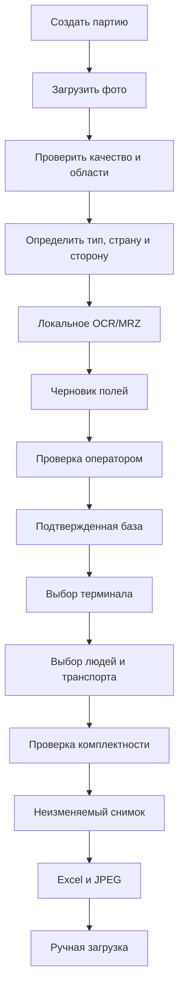

# Product specification

## 1. Назначение

Продукт подготавливает документы и данные для трех терминальных заявок, но не заменяет «Конверсту» и не отправляет заявки автоматически.

## 2. Пользователи

### Оператор

- создает партию;
- загружает фото;
- корректирует границы;
- подтверждает тип и сторону;
- проверяет OCR;
- связывает водителя, тягач и прицеп;
- выбирает терминал;
- формирует экспорт.

### Администратор

- управляет пользователями и шаблонами;
- выполняет backup/restore;
- подтверждает исключения;
- настраивает справочники;
- контролирует журнал.

## 3. Текущая проблема

Водители присылают фотографии отдельными файлами. В кадре могут быть фон, наклон, блики, несколько документов, только одна сторона или рукописный текст. Оператор вручную готовит изображения, перепечатывает данные и заполняет разные Excel-формы.

## 4. Целевой процесс

## 5. MVP

- Windows 11 x64;
- JPG/JPEG, PNG, HEIC/HEIF;
- партии;
- immutable originals;
- ручные рамки;
- несколько документов в кадре;
- склейка сторон;
- JPEG RGB ≤1,90 МиБ;
- ручная классификация;
- локальный OCR/MRZ для приоритетных классов;
- проверка поля рядом с изображением;
- база людей и транспорта;
- три Excel-адаптера;
- snapshots;
- аудит;
- backup;
- installer.

## 6. Не входит

- API «Конверсты»;
- browser automation;
- cloud OCR;
- cloud database;
- web/mobile application;
- server and microservices;
- криминалистическая экспертиза;
- гарантированное чтение рукописи;
- большая LLM/VLM;
- macOS release первого MVP.

## 7. Критические поля

- номер паспорта/ID;
- дата рождения;
- даты выдачи и окончания;
- VIN/шасси;
- госномер тягача;
- номер прицепа.

Экспорт блокируется при `UNVERIFIED`, `CONFLICT` или красном статусе.

## 8. Приоритеты

1. конфиденциальность;
2. сохранность оригиналов;
3. корректность Excel;
4. контроль критических полей;
5. удобство проверки;
6. скорость;
7. уровень автоматизации.

## 9. Метрики пилота

- медианное время комплекта;
- доля полей без исправления;
- доля фото без повторного запроса;
- число критических ошибок до экспорта;
- успешность Excel;
- успешность JPEG;
- количество ручных действий.

Метрики измеряются локально и не являются обещанием 100% OCR.

## 10. Готовность к пилоту

- подтверждены правила терминалов;
- очищены шаблоны;
- ручной контур работает без OCR;
- три адаптера прошли golden tests;
- реальная загрузка протестирована;
- определены доступ, backup и хранение.
