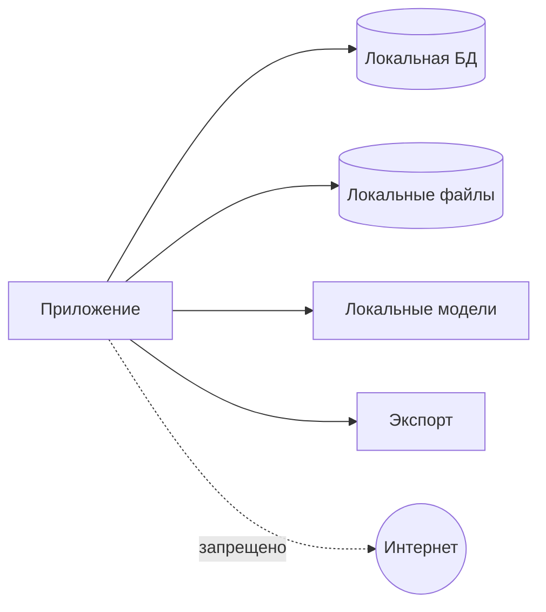

# Модель безопасности

## 1. Данные

Приложение обрабатывает паспорта, ID, миграционные карты, водительские удостоверения, разрешения, адреса, телефоны, даты рождения, VIN и регистрационные документы.

## 2. Граница доверия

Все реальные данные остаются на локальном рабочем месте или в отдельно утвержденной локальной инфраструктуре.

## 3. Угрозы

- случайная отправка наружу;
- PII в Git/CI/logs;
- кража ПК;
- доступ другого пользователя;
- подмена template/model;
- изменение original;
- незашифрованный backup;
- temp leftovers;
- неподтвержденный export;
- Excel external connections/formula injection.

## 4. Сеть

- runtime без сетевых запросов;
- модели установлены заранее;
- auto update отключен в MVP;
- no cloud fallback;
- no telemetry;
- network attempts тестируются.

## 5. Данные на диске

- DB encrypted;
- storage encrypted средствами приложения или утвержденной дисковой схемой;
- key не лежит открыто рядом;
- backup encrypted;
- temp restricted and cleaned.

Конкретная технология — отдельный ADR.

## 6. Роли

### OPERATOR

Обрабатывает партии, подтверждает обычные значения, создает заявки и export. Не управляет шаблонами, backup, users и admin override.

### ADMIN

Управляет configuration, templates, users, backup/restore and override.

## 7. Сессия

Local authentication, idle lock, re-authentication for admin actions, secure password hashing. Параметры требуют решения.

## 8. Логи

Запрещены full identity numbers, VIN+owner, phone, address, OCR text, MRZ, images and Excel rows.

Разрешены IDs, action/error codes, duration, version and masked suffix.

## 9. Excel security

- checksum template;
- read-only source;
- analyze external links;
- disable unsafe refresh in export copy;
- prevent formula injection in text fields;
- reopen and validate output.

## 10. Originals

Immutable, checksum-verified, all transforms create new artifacts, source replacement under same ID is forbidden.

## 11. Codex/Git/CI

Запрещены real documents, production DB/backups, filled workbooks, screenshots with PII, secrets and local acceptance logs.

CI uses synthetic fixtures only.

## 12. Backup/restore

Encrypted archive with manifest, checksum, format version and tested restore. Restore over active data requires explicit confirmation.

## 13. Audit

Импорт, boundaries, classification, field verification, override, snapshot, export, template replacement, backup/restore and deletion are audited without full PII.

## 14. Release checks

- dependency/license audit;
- no unexpected network;
- secret/PII scan;
- formula injection;
- template tampering;
- backup/restore;
- session permissions;
- masked logs;
- critical field block.

## 15. Нерешенные решения

Encryption implementation, Windows key storage, file encryption, password policy, idle timeout, retention, secure deletion and number of workstations.

## 16. Repository privacy guardrails

PR-003 adds a tracked-file repository policy scanner that runs locally and in CI. The scanner reads the current tracked tree with `git ls-files -z`; it does not recursively inspect untracked local directories and is not Git-history forensics.

The scanner enforces forbidden repository-root paths for runtime data, exports, logs, personal-data areas, private fixtures and local acceptance data. Root-level `storage/` is treated as runtime storage and does not apply to `src/document_intake/storage/`.

ADR-016 changes the approved-template boundary from file-type-based to content-based for `TSPMAINFILE.xls`, `visitors_example.xlsx` and `MGSMAINFILE.xlsx`. Those approved templates and PII-free technical derivatives may be committed only after technical privacy inspection and after a repository-policy enforcement PR updates scanner and `.gitignore` rules. Until that enforcement PR is merged, `resources/templates/README.md` remains the only permitted tracked file under `resources/templates/`. Real documents, personal data, real application data, operational databases, logs, backups, OCR/MRZ payloads from real documents, credentials and secrets remain prohibited.

Committed fixtures must be synthetic-only and may exist only under `tests/fixtures/synthetic/`. Private, real, production, local and acceptance fixture subtrees are blocked. PR-003 adds no document fixtures.

Tracked images are allowed only under `tests/fixtures/synthetic/`, and tracked synthetic images are limited to 1,992,294 bytes. This is the integer byte limit corresponding to 1.90 MiB.

The scanner detects a narrow set of high-confidence secret signatures: private-key markers, AWS access-key IDs, GitHub classic tokens, GitHub fine-grained tokens, OpenAI-style keys, Google API keys, Slack tokens and Stripe live secret keys. It does not use broad entropy heuristics and does not implement semantic PII detection.

Diagnostics include stable rule IDs, repository-relative paths and line numbers when applicable. Diagnostics must not print matched secrets, binary content or full source lines.

Passing the scanner reduces risk but cannot prove absence of every possible PII item or secret. Real-data acceptance remains local and outside Git and CI. A detected real secret requires separate credential revocation and incident handling. Passing the scanner does not authorize a file that violates higher-level policy or an accepted ADR.
