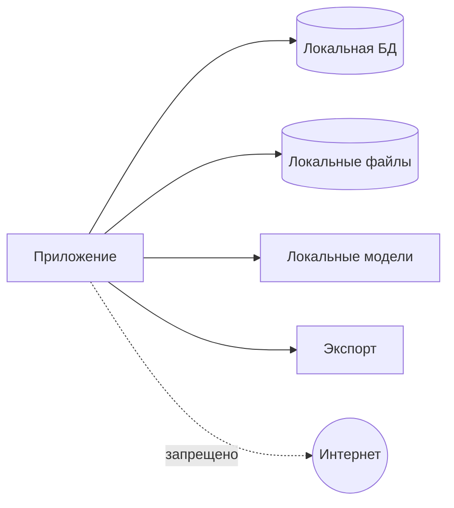

# Модель безопасности

## 1. Данные

Приложение обрабатывает паспорта, ID, миграционные карты, водительские удостоверения, разрешения, адреса, телефоны, даты рождения, VIN и регистрационные документы.

## 2. Граница доверия

Все реальные данные остаются на локальном рабочем месте или в отдельно утвержденной локальной инфраструктуре.

## 3. Угрозы

- случайная отправка наружу;
- PII в Git/CI/logs;
- кража ПК;
- доступ другого пользователя;
- подмена template/model;
- изменение original;
- незашифрованный backup;
- temp leftovers;
- неподтвержденный export;
- Excel external connections/formula injection.

## 4. Сеть

- runtime без сетевых запросов;
- модели установлены заранее;
- auto update отключен в MVP;
- no cloud fallback;
- no telemetry;
- network attempts тестируются.

## 5. Данные на диске

- ADR-018 is accepted: the application follows an encryption-first data-at-rest architecture.
- Production database and document storage must never persist production personal data in plaintext.
- Windows DPAPI Current User protects the first-MVP local root/master-key blob.
- The root/master key is not directly used as a database, file or future backup key; database, file-storage and future backup purposes require independent key material and purpose separation.
- SQLite requires SQLCipher or a separately validated equivalent with integrity authentication.
- Originals and derived artifacts require authenticated application-level encryption with a versioned encrypted-object envelope.
- BitLocker or Windows Device Encryption is defense in depth, not the sole security control.
- Encryption initialization failures and authentication failures fail closed.
- No plaintext fallback is permitted.

ADR-018 threat-model boundary: DPAPI Current User does not isolate applications running under the same Windows credentials. Same-user malware, malicious administrators, unlocked sessions and process-memory inspection are not fully mitigated; application security primarily protects data at rest.

ADR-018 rollback boundary: authenticated encrypted-object envelopes prove integrity and authenticity, but not freshness. Object-level rollback detection requires expected state outside the replaceable object. Coordinated rollback of the full encrypted database, storage and all local authoritative-state copies is not claimed as solved.

## 6. Роли

### OPERATOR

Обрабатывает партии, подтверждает обычные значения, создает заявки и export. Не управляет шаблонами, backup, users и admin override.

### ADMIN

Управляет configuration, templates, users, backup/restore and override.

## 7. Сессия

Local authentication, idle lock, re-authentication for admin actions, secure password hashing. Параметры требуют решения.

## 8. Логи

Запрещены full identity numbers, VIN+owner, phone, address, OCR text, MRZ, images and Excel rows.

Разрешены IDs, action/error codes, duration, version and masked suffix.

## 9. Excel security

- checksum template;
- read-only source;
- analyze external links;
- disable unsafe refresh in export copy;
- prevent formula injection in text fields;
- reopen and validate output.

## 10. Originals

Immutable, checksum-verified, all transforms create new artifacts, source replacement under same ID is forbidden.

## 11. Codex/Git/CI

Запрещены real documents, production DB/backups, filled workbooks, screenshots with PII, secrets and local acceptance logs.

CI uses synthetic fixtures only.

## 12. Backup/restore

Encrypted archive with manifest, checksum, format version and tested restore. Restore over active data requires explicit confirmation.

## 13. Audit

Импорт, boundaries, classification, field verification, override, snapshot, export, template replacement, backup/restore and deletion are audited without full PII.

## 14. Release checks

- dependency/license audit;
- no unexpected network;
- secret/PII scan;
- formula injection;
- template tampering;
- backup/restore;
- session permissions;
- masked logs;
- critical field block.

## 15. Нерешенные решения

Final packages and versions, final Python database binding, exact KDF/wrapping mechanics, exact encrypted-envelope format, final crash-consistency design, recovery policy, authentication, idle timeout, retention, secure deletion, full-system rollback anchor and number of workstations.

## 16. Repository privacy guardrails

PR-003 adds a tracked-file repository policy scanner that runs locally and in CI. The scanner reads the current tracked tree with `git ls-files -z`; it does not recursively inspect untracked local directories and is not Git-history forensics.

The scanner enforces forbidden repository-root paths for runtime data, exports, logs, personal-data areas, private fixtures and local acceptance data. Root-level `storage/` is treated as runtime storage and does not apply to `src/document_intake/storage/`.

ADR-016 changes the approved-template boundary from file-type-based to content-based for `TSPMAINFILE.xls`, `visitors_example.xlsx` and `MGSMAINFILE.xlsx`. Those approved templates and PII-free technical derivatives may be committed only after technical privacy inspection and after a repository-policy enforcement PR updates scanner and `.gitignore` rules. Until that enforcement PR is merged, `resources/templates/README.md` remains the only permitted tracked file under `resources/templates/`. Real documents, personal data, real application data, operational databases, logs, backups, OCR/MRZ payloads from real documents, credentials and secrets remain prohibited.

### Current scanner enforcement

Until the repository-policy enforcement PR is merged:

- ordinary committed document/data fixtures are permitted only under `tests/fixtures/synthetic/`;
- tracked images are permitted only under the current synthetic-image path;
- `resources/templates/README.md` is the only tracked template-directory file.

Private, real, production, local and acceptance fixture subtrees are blocked. PR-003 adds no document fixtures. Tracked synthetic images remain limited to 1,992,294 bytes, the integer byte limit corresponding to 1.90 MiB.

### ADR-016 exception after enforcement update

After the enforcement PR and required technical inspection:

- the three approved source templates may use explicitly approved template paths;
- approved binary golden files and synthetic output workbooks may use explicitly approved golden paths;
- PII-free structural template screenshots may use explicitly approved screenshot paths;
- manifests and mappings may use explicitly approved metadata paths.

The future enforcement PR must define those exact template paths, golden-file paths, screenshot paths and manifest/mapping paths. This exception applies only to the three approved templates and their PII-free derivatives. Real document images remain prohibited. Real application workbooks remain prohibited. PII-bearing screenshots and golden files remain prohibited. Secrets and credentials remain prohibited.

The scanner detects a narrow set of high-confidence secret signatures: private-key markers, AWS access-key IDs, GitHub classic tokens, GitHub fine-grained tokens, OpenAI-style keys, Google API keys, Slack tokens and Stripe live secret keys. It does not use broad entropy heuristics and does not implement semantic PII detection.

Diagnostics include stable rule IDs, repository-relative paths and line numbers when applicable. Diagnostics must not print matched secrets, binary content or full source lines.

Passing the scanner reduces risk but cannot prove absence of every possible PII item or secret. Real-data acceptance remains local and outside Git and CI. A detected real secret requires separate credential revocation and incident handling. Passing the scanner does not authorize a file that violates higher-level policy or an accepted ADR.
