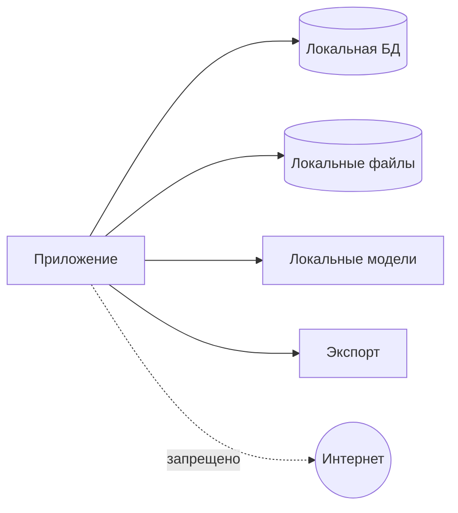

# Модель безопасности

## 1. Данные

Приложение обрабатывает паспорта, ID, миграционные карты, водительские удостоверения, разрешения, адреса, телефоны, даты рождения, VIN и регистрационные документы.

## 2. Граница доверия

Все реальные данные остаются на локальном рабочем месте или в отдельно утвержденной локальной инфраструктуре.

## 3. Угрозы

- случайная отправка наружу;
- PII в Git/CI/logs;
- кража ПК;
- доступ другого пользователя;
- подмена template/model;
- изменение original;
- незашифрованный backup;
- temp leftovers;
- неподтвержденный export;
- Excel external connections/formula injection.

## 4. Сеть

- runtime без сетевых запросов;
- модели установлены заранее;
- auto update отключен в MVP;
- no cloud fallback;
- no telemetry;
- network attempts тестируются.

## 5. Данные на диске

- DB encrypted;
- storage encrypted средствами приложения или утвержденной дисковой схемой;
- key не лежит открыто рядом;
- backup encrypted;
- temp restricted and cleaned.

Конкретная технология — отдельный ADR.

## 6. Роли

### OPERATOR

Обрабатывает партии, подтверждает обычные значения, создает заявки и export. Не управляет шаблонами, backup, users и admin override.

### ADMIN

Управляет configuration, templates, users, backup/restore and override.

## 7. Сессия

Local authentication, idle lock, re-authentication for admin actions, secure password hashing. Параметры требуют решения.

## 8. Логи

Запрещены full identity numbers, VIN+owner, phone, address, OCR text, MRZ, images and Excel rows.

Разрешены IDs, action/error codes, duration, version and masked suffix.

## 9. Excel security

- checksum template;
- read-only source;
- analyze external links;
- disable unsafe refresh in export copy;
- prevent formula injection in text fields;
- reopen and validate output.

## 10. Originals

Immutable, checksum-verified, all transforms create new artifacts, source replacement under same ID is forbidden.

## 11. Codex/Git/CI

Запрещены real documents, production DB/backups, filled workbooks, screenshots with PII, secrets and local acceptance logs.

CI uses synthetic fixtures only.

## 12. Backup/restore

Encrypted archive with manifest, checksum, format version and tested restore. Restore over active data requires explicit confirmation.

## 13. Audit

Импорт, boundaries, classification, field verification, override, snapshot, export, template replacement, backup/restore and deletion are audited without full PII.

## 14. Release checks

- dependency/license audit;
- no unexpected network;
- secret/PII scan;
- formula injection;
- template tampering;
- backup/restore;
- session permissions;
- masked logs;
- critical field block.

## 15. Нерешенные решения

Encryption implementation, Windows key storage, file encryption, password policy, idle timeout, retention, secure deletion and number of workstations.
