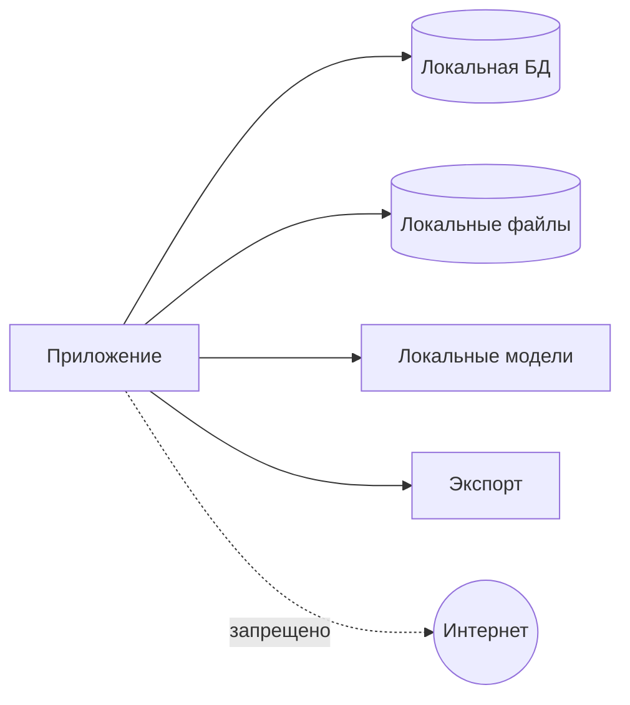

# Модель безопасности

## 1. Данные

Приложение обрабатывает паспорта, ID, миграционные карты, водительские удостоверения, разрешения, адреса, телефоны, даты рождения, VIN и регистрационные документы.

## 2. Граница доверия

Все реальные данные остаются на локальном рабочем месте или в отдельно утвержденной локальной инфраструктуре.

## 3. Угрозы

- случайная отправка наружу;
- PII в Git/CI/logs;
- кража ПК;
- доступ другого пользователя;
- подмена template/model;
- изменение original;
- незашифрованный backup;
- temp leftovers;
- неподтвержденный export;
- Excel external connections/formula injection.

## 4. Сеть

- runtime без сетевых запросов;
- модели установлены заранее;
- auto update отключен в MVP;
- no cloud fallback;
- no telemetry;
- network attempts тестируются.

## 5. Данные на диске

- ADR-018 is accepted: the application follows an encryption-first data-at-rest architecture.
- Production database and document storage must never persist production personal data in plaintext.
- Windows DPAPI Current User protects the first-MVP local root/master-key blob.
- The root/master key is not directly used as a database, file or future backup key; database, file-storage and future backup purposes require independent key material and purpose separation.
- SQLite requires SQLCipher or a separately validated equivalent with integrity authentication.
- Originals and derived artifacts require authenticated application-level encryption with a versioned encrypted-object envelope.
- BitLocker or Windows Device Encryption is defense in depth, not the sole security control.
- Encryption initialization failures and authentication failures fail closed.
- No plaintext fallback is permitted.

ADR-018 threat-model boundary: DPAPI Current User does not isolate applications running under the same Windows credentials. Same-user malware, malicious administrators, unlocked sessions and process-memory inspection are not fully mitigated; application security primarily protects data at rest.

ADR-018 rollback boundary: authenticated encrypted-object envelopes prove integrity and authenticity, but not freshness. Object-level rollback detection requires expected state outside the replaceable object. Coordinated rollback of the full encrypted database, storage and all local authoritative-state copies is not claimed as solved.

## 6. Роли

### OPERATOR

Обрабатывает партии, подтверждает обычные значения, создает заявки и export. Не управляет шаблонами, backup, users и admin override.

### ADMIN

Управляет configuration, templates, users, backup/restore and override.

## 7. Сессия

Local authentication, idle lock, re-authentication for admin actions, secure password hashing. Параметры требуют решения.

## 8. Логи

Запрещены full identity numbers, VIN+owner, phone, address, OCR text, MRZ, images and Excel rows.

Разрешены IDs, action/error codes, duration, version and masked suffix.

## 9. Excel security

- checksum template;
- read-only source;
- analyze external links;
- disable unsafe refresh in export copy;
- prevent formula injection in text fields;
- reopen and validate output.

## 10. Originals

Immutable, checksum-verified, all transforms create new artifacts, source replacement under same ID is forbidden.

## 11. Codex/Git/CI

Запрещены real documents, production DB/backups, filled workbooks, screenshots with PII, secrets and local acceptance logs.

CI uses synthetic fixtures only.

## 12. Backup/restore

Encrypted archive with manifest, checksum, format version and tested restore. Restore over active data requires explicit confirmation.

## 13. Audit

Импорт, boundaries, classification, field verification, override, snapshot, export, template replacement, backup/restore and deletion are audited without full PII.

## 14. Release checks

- dependency/license audit;
- no unexpected network;
- secret/PII scan;
- formula injection;
- template tampering;
- backup/restore;
- session permissions;
- masked logs;
- critical field block.

## 15. Нерешенные решения

Final packages and versions, final Python database binding, exact KDF/wrapping mechanics, exact encrypted-envelope format, final crash-consistency design, recovery policy, authentication, idle timeout, retention, secure deletion, full-system rollback anchor and number of workstations.

## 16. Repository privacy guardrails

PR-003 adds a tracked-file repository policy scanner that runs locally and in CI. The scanner reads the current tracked tree with `git ls-files -z`; it does not recursively inspect untracked local directories and is not Git-history forensics.

The scanner enforces forbidden repository-root paths for runtime data, exports, logs, personal-data areas, private fixtures and local acceptance data. Root-level `storage/` is treated as runtime storage and does not apply to `src/document_intake/storage/`.

ADR-016 changes the approved-template boundary from file-type-based to content-based for `TSPMAINFILE.xls`, `visitors_example.xlsx` and `MGSMAINFILE.xlsx`. Those approved templates and PII-free technical derivatives may be committed only after technical privacy inspection and after a repository-policy enforcement PR updates scanner and `.gitignore` rules. Until that enforcement PR is merged, `resources/templates/README.md` remains the only permitted tracked file under `resources/templates/`. Real documents, personal data, real application data, operational databases, logs, backups, OCR/MRZ payloads from real documents, credentials and secrets remain prohibited.

### Current scanner enforcement

Until the repository-policy enforcement PR is merged:

- ordinary committed document/data fixtures are permitted only under `tests/fixtures/synthetic/`;
- tracked images are permitted only under the current synthetic-image path;
- `resources/templates/README.md` is the only tracked template-directory file.

Private, real, production, local and acceptance fixture subtrees are blocked. PR-003 adds no document fixtures. Tracked synthetic images remain limited to 1,992,294 bytes, the integer byte limit corresponding to 1.90 MiB.

### ADR-016 exception after enforcement update

After the enforcement PR and required technical inspection:

- the three approved source templates may use explicitly approved template paths;
- approved binary golden files and synthetic output workbooks may use explicitly approved golden paths;
- PII-free structural template screenshots may use explicitly approved screenshot paths;
- manifests and mappings may use explicitly approved metadata paths.

The future enforcement PR must define those exact template paths, golden-file paths, screenshot paths and manifest/mapping paths. This exception applies only to the three approved templates and their PII-free derivatives. Real document images remain prohibited. Real application workbooks remain prohibited. PII-bearing screenshots and golden files remain prohibited. Secrets and credentials remain prohibited.

The scanner detects a narrow set of high-confidence secret signatures: private-key markers, AWS access-key IDs, GitHub classic tokens, GitHub fine-grained tokens, OpenAI-style keys, Google API keys, Slack tokens and Stripe live secret keys. It does not use broad entropy heuristics and does not implement semantic PII detection.

Diagnostics include stable rule IDs, repository-relative paths and line numbers when applicable. Diagnostics must not print matched secrets, binary content or full source lines.

Passing the scanner reduces risk but cannot prove absence of every possible PII item or secret. Real-data acceptance remains local and outside Git and CI. A detected real secret requires separate credential revocation and incident handling. Passing the scanner does not authorize a file that violates higher-level policy or an accepted ADR.

## PR-005 SQLCipher development boundary

PR-005 selects `sqlcipher3==0.6.2` for Windows AMD64 Python 3.12 development. Database keys cross the application boundary only through `DatabaseKeyProvider` and must be exactly 32 bytes. There is no plaintext fallback. `RISK-PR005-RAWKEY-PRAGMA` is accepted for PR-005 development because the raw-key PRAGMA is isolated in one private helper; it remains open for release. PR-005 does not implement DPAPI, key storage or key hierarchy and must not log keys or enable SQL tracing. Legal, redistribution and binding-safe API resolution remain release-boundary decisions.

PR-005 diagnostic boundary: a failure before successful keyed schema access maps to `ERR_DB_KEY_REJECTED` because a wrong key and early ciphertext corruption cannot be cryptographically distinguished at that point. Once keyed schema access succeeds, a failed or non-empty `cipher_integrity_check` maps to `ERR_DB_INTEGRITY_FAILED`. This distinction does not claim impossible root-cause diagnosis.

## PR-006 lifecycle note

PR-005: `COMPLETED AND HUMAN ACCEPTED`. PR-006: `COMPLETED AND HUMAN ACCEPTED`. PR-007: `COMPLETED AND HUMAN ACCEPTED`. PR-008: `COMPLETED AND HUMAN ACCEPTED WITH DOCUMENTED RESIDUAL RISK`; RISK-PR008-W11-SMOKE: `ACCEPTED FOR PR-008; DEFERRED TO INSTALLER/PILOT/RELEASE`; PR-009: `AUTHORIZED, NOT STARTED`; PR-010 AND LATER: `UNAUTHORIZED`; Gate 2: `NOT ACCEPTED`; M3: `IN PROGRESS`. Gate 1: `COMPLETED AND HUMAN ACCEPTED`. M2: `COMPLETED AND HUMAN ACCEPTED`. Q-009: `DEFERRED`; PR-006 implements immutable stored final artifacts and no retention, deletion or secure-deletion policy. Q-017: `DEFERRED`; PR-006 storage layout is backup-neutral and PR-032 remains responsible for encrypted backup/restore. Real documents and personal data remain prohibited in Git, Codex and CI.

## Lifecycle update — PR-006 acceptance and PR-007 authorization

Verified live base SHA: `4c117ededc250d57961e2f5f4c8b4de01edf0c54`.

PR-006: `COMPLETED AND HUMAN ACCEPTED` through GitHub PR `#17`, final reviewed head `28d8b590adb7a7ae11e35f631eb9895c930b3cef`, merge commit `4c117ededc250d57961e2f5f4c8b4de01edf0c54`, merge date `2026-07-19`, final v0001 checksum `e1e1f5f6d8d675a146f3d0c538a0d544b6f8a984c301d177ee1ad86e42f2d500`, final v0002 checksum `fb953af64efd3e860960eae8ef1f4078afd0a6ec078a33594e271a9285d7db3d`, local verification `306 passed, 2 skipped on macOS`, exact-head GitHub Actions jobs passed for Python checks on Ubuntu, Python checks on Windows, PR-S001 Windows encryption spike and PR-S001 DPAPI cross-runner negative, and exact-head CI workflow run `CI #85` succeeded.

ADR numbering after repair: ADR-019 is PR-005 SQLCipher binding and raw-key staging; ADR-020 is immutable encrypted filesystem storage v1; ADR-021 is immutable PII-safe audit events. The PR #17 description historically referred to the storage decision as ADR-019 before this documentation numbering correction.

PR-007: `COMPLETED AND HUMAN ACCEPTED`. PR-007 was merged and human accepted through GitHub PR #19. PR-008: `COMPLETED AND HUMAN ACCEPTED WITH DOCUMENTED RESIDUAL RISK`; RISK-PR008-W11-SMOKE: `ACCEPTED FOR PR-008; DEFERRED TO INSTALLER/PILOT/RELEASE`; PR-009: `AUTHORIZED, NOT STARTED`; PR-010 AND LATER: `UNAUTHORIZED`; Gate 2: `NOT ACCEPTED`; M3: `IN PROGRESS`. Gate 1: `COMPLETED AND HUMAN ACCEPTED`. M2: `COMPLETED AND HUMAN ACCEPTED`. PR-009 is authorized, not started; PR-010 and later remain unauthorized.

Q-009: `DEFERRED`. Q-017: `DEFERRED`. Q-010: `ACCEPTED`. `RISK-PR005-RAWKEY-PRAGMA` remains open for installer, pilot and production release. Existing unresolved SQLCipher legal, redistribution and release-binding questions remain unresolved. Real documents and personal data remain prohibited in Git, Codex, CI, logs and test reports. The sensitive-data/private-contour gate remains open for real data.

## Lifecycle update — PR-007 acceptance and PR-008 authorization

PR-007: `COMPLETED AND HUMAN ACCEPTED`. GitHub PR: `#19`. Final reviewed head: `c6d6852ba3cf28060d8fbb76e27201cbbcaade54`. Merge commit: `71dfd7fa31bd67c9f9fa54cc9057684486e842ad`. Merged date: `2026-07-20`. Exact-head CI: `CI #92`, successful. Migration v0003 final checksum: `e01d441c2572ca484cf5227d94f57a3cb62fa8e6e3e223eefc6852b81f6eb3c1`.

M2: `COMPLETED AND HUMAN ACCEPTED`. Gate 1: `COMPLETED AND HUMAN ACCEPTED`. PR-008: `COMPLETED AND HUMAN ACCEPTED WITH DOCUMENTED RESIDUAL RISK` for the non-UI encrypted original import and advisory duplicate-detection foundation only, governed by ADR-022, PR #21 and PR-008-D1. PR-009: `AUTHORIZED, NOT STARTED`; PR-010 AND LATER: `UNAUTHORIZED`. Do not claim Gate 2 is accepted, do not claim a physical Windows 11 smoke occurred, and do not begin PR-010 or later work.

Q-006: `DEFERRED`. Q-007: `DEFERRED`. Q-009: `DEFERRED`. Q-010: `ACCEPTED`. Q-017: `DEFERRED`. `RISK-PR005-RAWKEY-PRAGMA` remains open for installer, pilot and production release. The sensitive-data/private-contour gate remains open for real documents and real personal data. Real documents and personal data remain prohibited in Git, Codex, CI, logs and test reports.

## PR-008 implementation evidence note

PR-008 implementation records encrypted source-file import and advisory duplicate detection only. Original bytes are stored through the accepted encrypted storage port, metadata remains in SQLCipher, source paths are not persisted, decoder dependencies are pinned to `Pillow==12.3.0` and `pi-heif==1.4.0`, and no OCR, telemetry, cloud service, export, or PR-009 behavior is authorized by this change.

## PR-009 implementation lifecycle update — 2026-07-21

ADR-023: ACCEPTED.
PR-009: IMPLEMENTED AND IN REVIEW; NOT HUMAN ACCEPTED.
Q-021: OPEN — REQUIRES PRODUCT-OWNER ACCEPTANCE.
Production default quality policy: NOT ACTIVE.
Final PR-009 human acceptance: BLOCKED UNTIL Q-021 IS ACCEPTED.
PR-010 AND LATER: UNAUTHORIZED.
Gate 2: NOT ACCEPTED.
M3: IN PROGRESS.

PR-009 implements deterministic whole-frame metrics, explicit caller-provided typed policy handling, full-resolution orientation-normalized decoding, append-only persistence, audit integration, controlled service errors, synthetic tests and a cross-platform verifier. It does not select or activate production thresholds, add UI integration, reject documents automatically, implement PR-010 geometry, PR-011 JPEG preparation, PR-012 document detection/segmentation or use real-document calibration. Migration v0005 checksum: `6d020d1acfbce3fcb7168e935617f2ae008a32bea7def1f37de84e36e9e2224f`.
